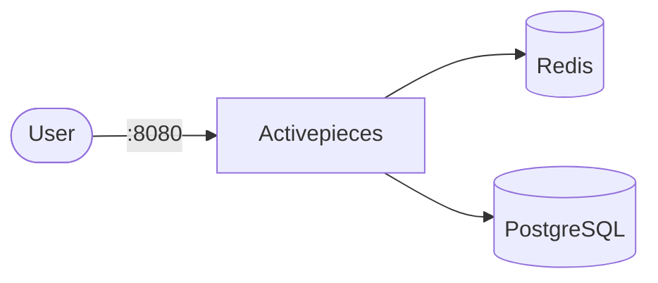

# Activepieces

Activepieces is an open-source workflow automation platform.
This setup runs Activepieces with Redis and PostgreSQL dependencies.

## How it works



1. Redis provides cache/queue support.
2. PostgreSQL stores application/workflow data.
3. Activepieces starts after both dependencies are healthy (readiness probes).
4. The web app/API is exposed on port `8080`.

## Stack details in this repo

- Activepieces image: `activepieces/activepieces:latest`
- Database image: `postgres:16`
- Cache image: `redis:7`
- Namespace: `activepieces-ns`
- Deployments: `activepieces-deployment` (1 replica), `activepieces-db-deployment` (1 replica), `activepieces-redis-deployment` (1 replica)
- Services: `activepieces-service` (ClusterIP `:8080` → `:80`), `activepieces-db-service` (ClusterIP `:5432`, internal only), `activepieces-redis-service` (ClusterIP `:6379`, internal only)
- ConfigMaps: `activepieces-config` (hosts, ports, frontend URL, feature flags), `activepieces-db-config`
- Secret: `activepieces-secrets` (`postgres-user`, `postgres-password`, `postgres-db`, `encryption-key`, `jwt-secret`)
- Persistent Volume Claims:
  - `activepieces-data-storage-claim` (5Gi, mounted at `/root/.activepieces`)
  - `activepieces-db-storage-claim` (5Gi, mounted at `/var/lib/postgresql/data`)
  - `activepieces-redis-storage-claim` (2Gi, mounted at `/data`)
- Web UI: `http://<service-ip>:8080` (default)

### Compose mapping

| Compose service | Kubernetes resources |
| --- | --- |
| `activepieces` (port `80`, `AP_*` env, `activepieces_data` volume, waits for redis + db) | `activepieces-deployment` + `activepieces-service` (`:8080` → `:80`), env from `activepieces-config` + `activepieces-secrets` |
| `db` (`postgres:16`, `postgres_data` volume, `pg_isready` healthcheck) | `activepieces-db-deployment` + `activepieces-db-service` + `activepieces-db-storage-claim`, `pg_isready` probes |
| `redis` (`redis:7`, `redis_data` volume, `redis-cli ping` healthcheck) | `activepieces-redis-deployment` + `activepieces-redis-service` + `activepieces-redis-storage-claim`, `redis-cli ping` probes |
| `postgres_data`, `redis_data`, `activepieces_data` volumes | matching PVCs in `storage-claim.yaml` |
| `.env` (`AP_REDIS_*`, `AP_POSTGRES_*`, `AP_FRONTEND_URL`, `AP_ENCRYPTION_KEY`, `AP_JWT_SECRET`, ...) | `activepieces-config` + `activepieces-secrets` — edit before applying |

## Kubernetes Resources

### Namespace

```bash
kubectl apply -f namespace.yaml
```

### Secret

```bash
kubectl apply -f secret.yaml
```

Generate a secure encryption key if needed:

```bash
openssl rand -hex 16
```

### ConfigMap

```bash
kubectl apply -f configmap.yaml
```

Edit `configmap.yaml` / `secret.yaml` to customize hosts, credentials, and app settings.

### PersistentVolumeClaim

```bash
kubectl apply -f storage-claim.yaml
```

### Deployment

```bash
kubectl apply -f deployment.yaml
```

### Service

```bash
kubectl apply -f service.yaml
```

## How to run

```bash
kubectl apply -f .
```

This will create all required resources:

- Namespace
- Secret
- ConfigMaps
- PersistentVolumeClaims (app data, database, redis)
- Deployments (Activepieces + PostgreSQL + Redis)
- Services (Activepieces + PostgreSQL + Redis)

## Access

- Port-forward: `kubectl port-forward svc/activepieces-service 8080:8080 -n activepieces-ns`
- Access via: `http://localhost:8080`
- Or expose via Ingress/LoadBalancer for external access

## Notes

- Keep `encryption-key` and `jwt-secret` in `secret.yaml` private — the defaults match `.env.example` placeholders.
- If startup takes longer, check health of the redis and db deployments first.
- PostgreSQL and Redis run with 1 replica each — do not scale them.
