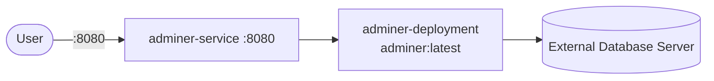

# Adminer

Adminer is a lightweight web-based database management tool that supports MySQL, PostgreSQL, MariaDB, SQLite, and more. On Kubernetes it runs as a stateless Deployment fronted by a Service in its own namespace.

## How it works



1. `adminer-deployment` (3 replicas) runs container `adminer` (`adminer:latest`, `containerPort: 8080`).
2. `adminer-service` exposes port `8080` -> `targetPort: 8080` inside the cluster.
3. You open the Adminer UI and provide DB connection details.
4. Adminer connects directly to your database server to browse tables and run queries.

## Stack details in this repo

- Image: `adminer:latest`
- Namespace: `adminer-ns`
- Deployment: `adminer-deployment` (3 replicas, container `adminer`, `containerPort: 8080` named `adminer-port`)
- Service: `adminer-service` (port `8080` -> `targetPort: 8080`, selector `app: adminer`)
- ConfigMaps/Secrets: none
- Persistent Volume Claims: none (stateless UI, does not store DB data)
- Web UI: `http://<service-ip>:8080` (via Service / port-forward)

## Kubernetes Resources

### Namespace

```bash
kubectl apply -f namespace.yaml
```

### Deployment

Runs 3 replicas of `adminer:latest` with `containerPort: 8080`:

```bash
kubectl apply -f deployment.yaml
```

### Service

```bash
kubectl apply -f service.yaml
```

## How to run

```bash
kubectl apply -f .
```

This will create all required resources:

- Namespace (`adminer-ns`)
- Deployment (`adminer-deployment`)
- Service (`adminer-service`)

## Access

- Port-forward: `kubectl port-forward svc/adminer-service 8081:8080 -n adminer-ns`
- Access via: `http://localhost:8081`
- Or expose via Ingress/LoadBalancer for external access

## Notes

- Adminer does not persist your database data; it is only a management UI.
- For Kubernetes-hosted databases, use the database Service name as server host (e.g. `db-service`, `postgres-service`, `mysql-service`); for external databases use a reachable host/IP and correct port.
- Use least-privilege DB credentials for routine operations.
- Restrict external exposure of Adminer in production environments.
- Scales horizontally (`replicas: 3` in `deployment.yaml`); scale with `kubectl scale deployment adminer-deployment -n adminer-ns --replicas=N` if needed.

## References

- Official site: <https://www.adminer.org/en/>
- GitHub repo: <https://github.com/vrana/adminer>
- Docker Hub image: <https://hub.docker.com/_/adminer/>
- YouTube — How to Setup MariaDB + Adminer with Docker Compose: <https://www.youtube.com/watch?v=uAH2zCYzhNw>
- Kubernetes documentation: <https://kubernetes.io/docs/>
