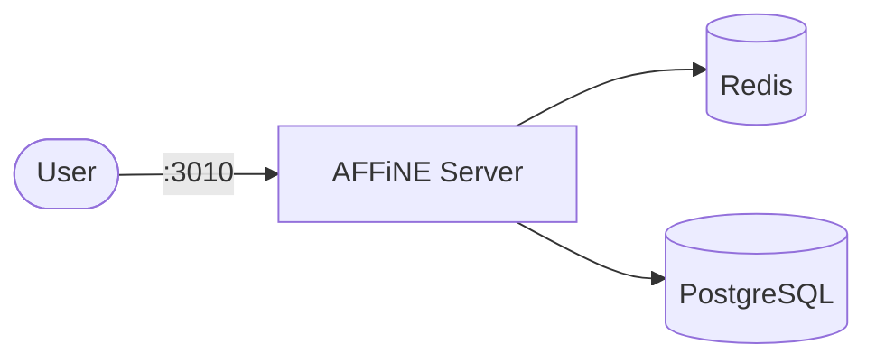

# AFFiNE

AFFiNE is an open-source knowledge base that combines docs, whiteboards, and databases — a privacy-focused alternative to Notion and Miro.

## How AFFiNE works



1. A migration job prepares the database schema before the main server starts.
2. The main server provides a web UI for documents, whiteboards, and databases.
3. Redis handles session caching and job queues.
4. PostgreSQL (pgvector) stores all persistent data.

## Stack details in this repo

- Image: `ghcr.io/toeverything/affine:stable`
- Database image: `pgvector/pgvector:pg16`
- Cache image: `redis:7-alpine`
- Namespace: `affine-ns`
- Deployments: `affine-deployment` (1 replica), `affine-db-deployment` (1 replica), `affine-redis-deployment` (1 replica)
- Job: `affine-migration` (one-shot schema predeploy, see `migration/`)
- Services: `affine-service` (ClusterIP `:3010`), `affine-db-service` (ClusterIP `:5432`, internal only), `affine-redis-service` (ClusterIP `:6379`, internal only)
- ConfigMaps: `affine-config` (`REDIS_SERVER_HOST`), `affine-db-config`
- Secret: `affine-secrets` (`postgres-user`, `postgres-password`, `postgres-db`, `database-url`)
- Persistent Volume Claims:
  - `affine-storage-claim` (5Gi, mounted at `/root/.affine/storage`)
  - `affine-config-storage-claim` (1Gi, mounted at `/root/.affine/config`)
  - `affine-db-storage-claim` (5Gi, mounted at `/var/lib/postgresql/data`)
- Web UI: `http://<service-ip>:3010` (default)

### Compose mapping

| Compose service | Kubernetes resources |
| --- | --- |
| `affine` (port `3010`, `REDIS_SERVER_HOST` + `DATABASE_URL` env, storage/config volumes, waits for migration) | `affine-deployment` + `affine-service` |
| `affine_migration` (`restart: no`, `node ./scripts/self-host-predeploy.js`, same env/volumes) | `migration/job.yaml` (`affine-migration` Job, `restartPolicy: OnFailure`) |
| `postgres` (`pgvector/pgvector:pg16`, data volume, `POSTGRES_*` env, `pg_isready` healthcheck) | `affine-db-deployment` + `affine-db-service` + `affine-db-storage-claim`, `pg_isready` probes |
| `redis` (`redis:7-alpine`, `redis-cli incr ping` healthcheck) | `affine-redis-deployment` + `affine-redis-service`, `redis-cli` probes |
| `${UPLOAD_LOCATION}`, `${CONFIG_LOCATION}`, `${DB_DATA_LOCATION}` bind mounts | PVCs in `storage-claim.yaml` |
| `${AFFINE_PORT:-3010}`, `${DB_USERNAME:-affine}`, `${DB_PASSWORD:-affine}`, `${DB_DATABASE:-affine}` | `affine-config` + `affine-secrets` — edit before applying |

## Kubernetes Resources

### Namespace

```bash
kubectl apply -f namespace.yaml
```

### Secret

```bash
kubectl apply -f secret.yaml
```

Important: if you change the database user, password, or name, update `database-url` to match — the app connects via `DATABASE_URL`, which points at `affine-db-service:5432` (rewritten from the compose `postgres:5432` value).

### ConfigMap

```bash
kubectl apply -f configmap.yaml
```

Edit `configmap.yaml` / `secret.yaml` to customize credentials and hosts.

### PersistentVolumeClaim

```bash
kubectl apply -f storage-claim.yaml
```

### Deployment

```bash
kubectl apply -f deployment.yaml
```

### Service

```bash
kubectl apply -f service.yaml
```

### Migration Job

Run the one-shot schema migration before starting the server (equivalent of compose `service_completed_successfully` ordering — apply in this order):

```bash
kubectl apply -f migration/job.yaml
kubectl wait --for=condition=complete job/affine-migration -n affine-ns --timeout=300s
```

## How to run

```bash
kubectl apply -f namespace.yaml -f secret.yaml -f configmap.yaml -f storage-claim.yaml -f deployment.yaml -f service.yaml
kubectl apply -f migration/job.yaml
kubectl wait --for=condition=complete job/affine-migration -n affine-ns --timeout=300s
```

(`kubectl apply -f .` does not recurse into `migration/` — apply it separately.)

This will create all required resources:

- Namespace
- Secret
- ConfigMaps
- PersistentVolumeClaims (storage, config, database)
- Deployments (AFFiNE + PostgreSQL + Redis)
- Services (AFFiNE + PostgreSQL + Redis)
- Migration Job (one-shot)

## Access

- Port-forward: `kubectl port-forward svc/affine-service 3010:3010 -n affine-ns`
- Access via: `http://localhost:3010`
- Or expose via Ingress/LoadBalancer for external access

## Use it effectively

- AFFiNE supports Markdown and rich-text editing for documents.
- Use the whiteboard mode for visual brainstorming and diagrams.
- Databases allow structured data with custom fields and views.
- Set up user accounts from the admin panel on first run.

## Notes

- The migration job runs once and must complete before the main server starts (compose enforced this via `service_completed_successfully`).
- Change the host port by editing `affine-service`, and default credentials in `secret.yaml` before exposing externally.
- PostgreSQL and Redis run with 1 replica each — do not scale them.
- See [AFFiNE GitHub](https://github.com/toeverything/AFFiNE) for more details.
