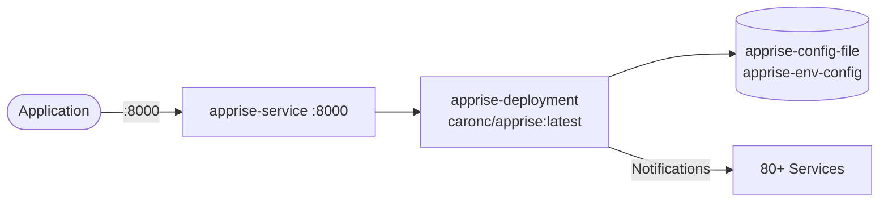

# Apprise API

Apprise is a push notification library that supports 80+ notification services. This setup runs the Apprise API server for sending notifications on Kubernetes.

## How it works



1. `apprise-deployment` (4 replicas) runs container `apprise` (`caronc/apprise:latest`, `containerPort: 8000`).
2. `apprise-service` exposes port `8000` -> `targetPort: 8000` inside the cluster.
3. Configuration is loaded from ConfigMap `apprise-config-file` mounted at `/config/apprise.yml` (`subPath: apprise.yml`).
4. Env is loaded via `envFrom` from ConfigMap `apprise-env-config` (`APPRISE_STATEFUL_MODE: simple`).
5. Clients `POST /notify/<key>` (default key `apprise`) to fan out to Slack, Discord, Telegram, Email, etc.

## Stack details in this repo

- Image: `caronc/apprise:latest`
- Namespace: `apprise-ns`
- Deployment: `apprise-deployment` (4 replicas, container `apprise`, `containerPort: 8000` named `apprise-port`)
  - `envFrom` ConfigMap: `apprise-env-config`
  - `volumeMounts`: `apprise-config-file` at `/config/apprise.yml` (`subPath: apprise.yml`)
  - `volumes`: `apprise-config-file` from ConfigMap `apprise-config-file`
- Service: `apprise-service` (port `8000` -> `targetPort: 8000`, selector `app: apprise`)
- ConfigMaps:
  - `apprise-config-file` (`apprise.yml: "urls:\r - tgram://123456789:AAHjExampleBotTokenABCxyz/987654321\r\n"`)
  - `apprise-env-config` (`APPRISE_STATEFUL_MODE: simple`)
- Persistent Volume Claims: none
- Web UI / API: `http://<service-ip>:8000` (via Service / port-forward)

## Kubernetes Resources

### Namespace

```bash
kubectl apply -f namespace.yaml
```

### ConfigMap

Creates `apprise-config-file` (notification URLs) and `apprise-env-config` (stateful mode):

```bash
kubectl apply -f configmap.yaml
```

Edit `configmap.yaml` to add your own notification URLs (Slack, Discord, Telegram, etc.) before applying. Do not commit real tokens.

### Deployment

```bash
kubectl apply -f deployment.yaml
```

### Service

```bash
kubectl apply -f service.yaml
```

## How to run

```bash
kubectl apply -f .
```

This will create all required resources:

- Namespace (`apprise-ns`)
- ConfigMaps (`apprise-config-file`, `apprise-env-config`)
- Deployment (`apprise-deployment`)
- Service (`apprise-service`)

## Access

- Port-forward: `kubectl port-forward svc/apprise-service 8000:8000 -n apprise-ns`
- Access via: `http://localhost:8000`
- Verify configured URLs: `curl http://localhost:8000/json/urls/apprise`
- Send test notification: `curl -X POST http://localhost:8000/notify/apprise -H "Content-Type: application/json" -d '{"title":"Deployment","body":"Application deployed successfully"}'`
- Or expose via Ingress/LoadBalancer for external access

## Notes

- The default configuration key in this setup is `apprise` (`POST /notify/apprise`); requesting `POST /notify` without a key returns `No valid URLs provided`.
- ConfigMap `apprise-config-file` contains a placeholder Telegram URL — replace it with your own `apprise.yml` URLs before use.
- Env `APPRISE_STATEFUL_MODE: simple` comes from ConfigMap `apprise-env-config`.
- Regularly rotate notification tokens and credentials; avoid committing secrets into Git — use Secrets or external secret managers for production.
- Monitor logs (`kubectl logs -f deploy/apprise-deployment -n apprise-ns`) for notification failures and implement retry handling for critical workflows.

## References

- Official site and documentation: <https://appriseit.com/getting-started/>
- GitHub repo: <https://github.com/caronc/apprise>
- Apprise API repo: <https://github.com/caronc/apprise-api>
- Docker Hub image: <https://hub.docker.com/r/caronc/apprise>
- YouTube — Best Notification System for Home Servers with Apprise Push Alerts (VirtualizationHowto): <https://www.youtube.com/watch?v=Cj7A46NuACA>
- Kubernetes documentation: <https://kubernetes.io/docs/>
