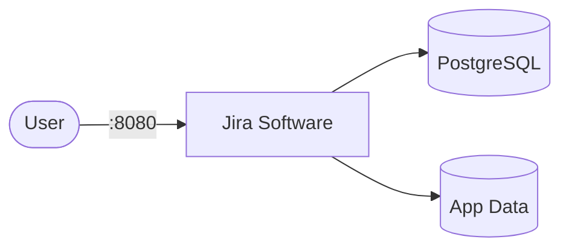

# Atlassian Jira

Jira is a project management and issue tracking platform by Atlassian.
It supports agile boards, workflows, sprints, and backlog management for software teams.

Converted from `docker-compose-collections/atlassian-jira/docker-compose.yml` to Kubernetes manifests.

## How Jira works



1. Jira starts and serves the web UI on port 8080.
2. PostgreSQL stores all project data, issues, users, and workflows.
3. Application data (attachments, plugins, logs) persists in the data volume.
4. On first access, Jira runs a setup wizard to configure license and admin account.

## Stack details in this repo

- Jira image: `atlassian/jira-software:latest`
- Database image: `postgres:15`
- Namespace: `atlassian-jira-ns`
- Deployments: `jira-deployment` (1 replica), `jira-db-deployment` (1 replica)
- Services: `jira-service` (ClusterIP `:8080`), `jira-db-service` (ClusterIP `:5432`, internal only)
- ConfigMaps: `jira-config` (`ATL_JDBC_URL`), `jira-db-config`
- Secret: `jira-secrets` (`postgres-user`, `postgres-password`, `postgres-db`, `jdbc-user`, `jdbc-password`)
- Persistent Volume Claims:
  - `jira-data-storage-claim` (10Gi, mounted at `/var/atlassian/application-data/jira`)
  - `jira-db-storage-claim` (5Gi, mounted at `/var/lib/postgresql/data`)
- Web UI: `http://<service-ip>:8080` (default)

### Compose mapping

| Compose service | Kubernetes resources |
| --- | --- |
| `jira` (port `8080`, `ATL_JDBC_*` env, `./data` bind mount, `depends_on: postgres`) | `jira-deployment` + `jira-service`, env from `jira-config` + `jira-secrets` (long startup probes — first boot takes minutes) |
| `postgres` (`postgres:15`, `db-data` volume, `5432:5432` port mapping) | `jira-db-deployment` + `jira-db-service` (internal-only) + `jira-db-storage-claim`, `pg_isready` probes |
| `./data` bind mount, `db-data` named volume | `jira-data-storage-claim`, `jira-db-storage-claim` PVCs |
| `ATL_JDBC_URL=jdbc:postgresql://postgres:5432/jiradb`, `ATL_JDBC_USER/PASSWORD`, `POSTGRES_*` | `jira-config` + `jira-secrets` — edit before applying |

## Kubernetes Resources

### Namespace

```bash
kubectl apply -f namespace.yaml
```

### Secret

Create the Secret with credentials (edit defaults before use):

```bash
kubectl apply -f secret.yaml
```

Important: `ATL_JDBC_USER`/`ATL_JDBC_PASSWORD` must match the PostgreSQL user/password — keep `jdbc-*` and `postgres-*` keys in sync.

### ConfigMap

```bash
kubectl apply -f configmap.yaml
```

### PersistentVolumeClaim

```bash
kubectl apply -f storage-claim.yaml
```

### Deployment

```bash
kubectl apply -f deployment.yaml
```

### Service

```bash
kubectl apply -f service.yaml
```

## How to run

```bash
kubectl apply -f .
```

This will create all required resources:

- Namespace
- Secret
- ConfigMaps
- PersistentVolumeClaims (app data + database)
- Deployments (Jira + PostgreSQL)
- Services (Jira + PostgreSQL)

## Access

- Port-forward: `kubectl port-forward svc/jira-service 8080:8080 -n atlassian-jira-ns`
- Access via: `http://localhost:8080`
- Or expose via Ingress/LoadBalancer for external access

Follow the setup wizard on first launch to configure your license and admin account.

## Use it effectively

- Use Scrum or Kanban boards to manage sprints and workflows.
- Configure custom issue types and workflows for your team's process.
- Integrate with Bitbucket, Confluence, or CI/CD tools for traceability.
- Export backups regularly from Administration → System → Backup.

## Notes

- Change default database credentials in `secret.yaml` before exposing externally.
- Jira requires a valid license (free trial available from Atlassian).
- First startup can take several minutes — probes allow a long startup window; allocate at least 2GB RAM.
- PostgreSQL runs with 1 replica — do not scale it; Jira itself runs a single node (Data Center clustering is not configured here).
