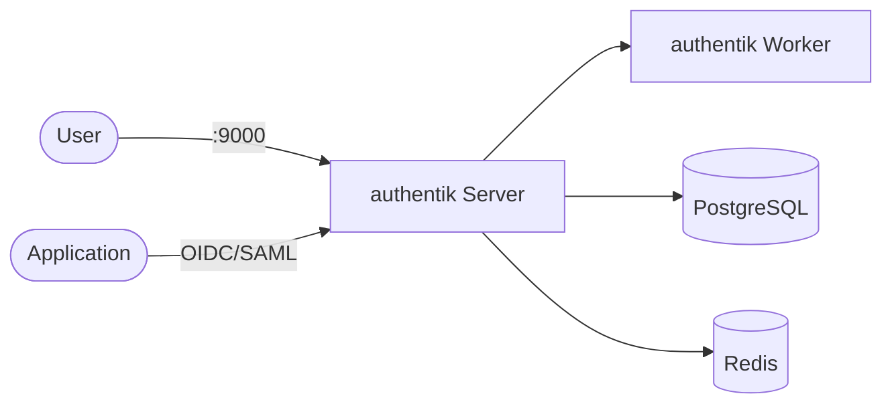

# authentik

authentik is an open-source identity provider (IdP) and SSO platform for applications and internal services.

Converted from `docker-compose-collections/authentik/docker-compose.yml` to Kubernetes manifests.

## How it works



1. `authentik-server` provides the UI/API.
2. `authentik-worker` runs background jobs and outposts.
3. PostgreSQL stores configuration and identity data.
4. Redis is used for cache and queue processing.

## Stack details in this repo

- Server/Worker image: `ghcr.io/goauthentik/server:latest` (`server` and `worker` commands via `args`)
- Dependencies: `postgres:16`, `redis:7`
- Namespace: `authentik-ns`
- Deployments: `authentik-server-deployment`, `authentik-worker-deployment`, `authentik-db-deployment`, `authentik-redis-deployment` (1 replica each)
- Services: `authentik-server-service` (ClusterIP `:9000`), `authentik-db-service` (ClusterIP `:5432`, internal only), `authentik-redis-service` (ClusterIP `:6379`, internal only)
- ConfigMaps: `authentik-config` (service hosts, bootstrap username/email), `authentik-db-config`
- Secret: `authentik-secrets` (`postgres-user`, `postgres-password`, `postgres-db`, `secret-key`, `bootstrap-password`)
- Persistent Volume Claims:
  - `authentik-db-storage-claim` (5Gi, mounted at `/var/lib/postgresql/data`)
  - `authentik-redis-storage-claim` (2Gi, mounted at `/data`)
  - `authentik-media-storage-claim` (5Gi, mounted at `/media` on server and worker)
  - `authentik-certs-storage-claim` (1Gi, mounted at `/certs` on worker)
  - `authentik-templates-storage-claim` (1Gi, mounted at `/templates` on server and worker)
- Web UI: `http://<service-ip>:9000` (default)

### Compose mapping

| Compose service | Kubernetes resources |
| --- | --- |
| `authentik-server` (`ghcr.io/goauthentik/server:latest`, `command: server`, port `9000`, `depends_on` postgres/redis, `media` + `custom-templates` volumes) | `authentik-server-deployment` (`args: [server]`) + `authentik-server-service`, env from `authentik-config` + `authentik-secrets` |
| `authentik-worker` (`command: worker`, `media` + `certs` + `custom-templates` volumes) | `authentik-worker-deployment` (`args: [worker]`, no Service — no ports) |
| `postgresql` (`postgres:16`, `database` volume) | `authentik-db-deployment` + `authentik-db-service` + `authentik-db-storage-claim`, `pg_isready` readiness/liveness probes |
| `redis` (`redis:7`, `redis` volume) | `authentik-redis-deployment` + `authentik-redis-service` + `authentik-redis-storage-claim`, `redis-cli ping` readiness/liveness probes |
| `database`, `redis`, `media`, `certs`, `custom-templates` volumes | matching PVCs in `storage-claim.yaml` |
| `${AUTHENTIK_PORT:-9001}`, `${AUTHENTIK_POSTGRES_*}`, `${AUTHENTIK_SECRET_KEY}`, `${AUTHENTIK_BOOTSTRAP_*}` | `authentik-config` + `authentik-secrets` — edit before applying |

## Kubernetes Resources

### Namespace

```bash
kubectl apply -f namespace.yaml
```

### Secret

Create the Secret with credentials (edit defaults before use):

```bash
kubectl apply -f secret.yaml
```

### ConfigMap

```bash
kubectl apply -f configmap.yaml
```

Edit `configmap.yaml` to change service hosts or bootstrap username/email.
Edit `secret.yaml` to change database credentials, `secret-key`, or bootstrap password.

### PersistentVolumeClaim

```bash
kubectl apply -f storage-claim.yaml
```

### Deployment

Deploys server, worker, PostgreSQL, and Redis (server/worker reach dependencies via ClusterIP services):

```bash
kubectl apply -f deployment.yaml
```

### Service

```bash
kubectl apply -f service.yaml
```

## How to run

```bash
kubectl apply -f .
```

This will create all required resources:

- Namespace
- Secret
- ConfigMaps
- PersistentVolumeClaims (database, redis, media, certs, templates)
- Deployments (server, worker, PostgreSQL, Redis)
- Services (server, PostgreSQL, Redis)

## Access

- Port-forward: `kubectl port-forward svc/authentik-server-service 9001:9000 -n authentik-ns`
- Access via: `http://localhost:9001`
- Or expose via Ingress/LoadBalancer for external access

## Reset admin password

If login fails and you need to reset the `akadmin` password (equivalent of the compose `ak changepassword` step):

```bash
kubectl exec -n authentik-ns deploy/authentik-server-deployment -- ak changepassword akadmin
```

Then sign in again with username `akadmin` and the new password.

## Notes

- First startup can take a few minutes.
- Change `secret-key` and `bootstrap-password` in `secret.yaml` before production use.
- The worker's `/var/run/docker.sock` mount from compose is intentionally omitted (no Docker socket on Kubernetes); outposts that require it need a different setup.
- PostgreSQL and Redis run with 1 replica each — do not scale them; scale only server/worker with `kubectl scale deployment <name> -n authentik-ns` if needed.
