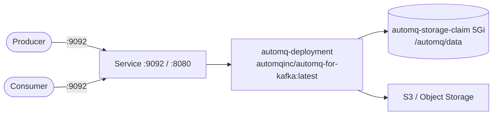

# AutoMQ

AutoMQ is a cloud-native, cost-effective, and high-performance Kafka alternative built on S3-compatible object storage. This stack runs the official AutoMQ for Kafka container image for streaming data pipelines on Kubernetes.

## How it works



1. `automq-deployment` (5 replicas) runs container `automq` (`automqinc/automq-for-kafka:latest`).
2. Container exposes `9092` (`automq-port`, Kafka-compatible broker) and `8080` (`automq-mgmt-port`, management/UI).
3. The Service exposes port `9092` -> `targetPort: 9092` and port `8080` -> `targetPort: 8080`.
4. Data persists in PVC `automq-storage-claim` (5Gi) mounted at `/automq/data`.
5. Producers/consumers use standard Kafka clients against `:9092`.

## Stack details in this repo

- Image: `automqinc/automq-for-kafka:latest`
- Namespace: `automq-ns`
- Deployment: `automq-deployment` (5 replicas, container `automq`)
  - `containerPort: 9092` named `automq-port`
  - `containerPort: 8080` named `automq-mgmt-port`
  - `volumeMounts`: `automq-storage` at `/automq/data` (from PVC `automq-storage-claim` via `claimName: automq-storage-claim`)
- Service: manifest in `service.yaml` (selector `app: automq`, port `9092` -> `targetPort: 9092` named `automq-port`, port `8080` -> `targetPort: 8080` named `automq-mgmt-port`) — note: `metadata.name` is not set in `service.yaml`
- ConfigMaps/Secrets: none
- Persistent Volume Claims:
  - `automq-storage-claim` (5Gi, `ReadWriteOnce`, mounted at `/automq/data`)
- Web UI / management: `http://<service-ip>:8080` (via Service / port-forward)
- Kafka broker: `<service-ip>:9092`

## Kubernetes Resources

### Namespace

```bash
kubectl apply -f namespace.yaml
```

### PersistentVolumeClaim

```bash
kubectl apply -f storage-claim.yaml
```

### Deployment

Deploys 5 replicas with `/automq/data` backed by `automq-storage-claim`:

```bash
kubectl apply -f deployment.yaml
```

### Service

> Note: `service.yaml` in this repo sets `metadata.namespace: automq-ns` but has no `metadata.name`. Add a `name` (e.g. `automq-service`) before applying, then:

```bash
kubectl apply -f service.yaml
```

## How to run

```bash
kubectl apply -f .
```

This will create all required resources:

- Namespace (`automq-ns`)
- PersistentVolumeClaim (`automq-storage-claim`)
- Deployment (`automq-deployment`)
- Service (ports `9092` and `8080` — add `metadata.name` first, see note above)

## Access

`service.yaml` exposes ports `9092` and `8080` in namespace `automq-ns`, but defines no Service `metadata.name`, so a `svc/<name>` port-forward cannot be derived verbatim from the manifests. Options:

- Port-forward the Deployment directly (no Service name needed):
  - Broker: `kubectl port-forward deploy/automq-deployment 9092:9092 -n automq-ns`
  - Management UI: `kubectl port-forward deploy/automq-deployment 8080:8080 -n automq-ns`
- Or, after adding a `metadata.name` to `service.yaml` and applying, discover it with `kubectl get svc -n automq-ns` and then e.g. `kubectl port-forward svc/<actual-name> 9092:9092 -n automq-ns`.
- Access management UI via: `http://localhost:8080`
- Or expose via Ingress/LoadBalancer for external access

## Notes

- AutoMQ is fully compatible with Apache Kafka APIs — use standard Kafka clients (librdkafka, kafka-python, etc.).
- `replicas: 5` is set in `deployment.yaml`; Kafka-style brokers are stateful — do not scale blindly without understanding clustering/object-storage configuration.
- Data persists via `automq-storage-claim` (5Gi, `ReadWriteOnce`); a single `ReadWriteOnce` PVC cannot be shared by 5 replicas on different nodes — use one replica per PVC or a StatefulSet with `volumeClaimTemplates` for multi-broker setups.
- Access the management UI at `http://localhost:8080` (after port-forward).
- For production, configure a proper object storage backend (S3, MinIO, etc.) — no object-storage env vars are set in these manifests.

## References

- Official site: <https://www.automq.com/>
- Documentation: <https://docs.automq.com/>
- Docker deploy guide: <https://docs.automq.com/automq/getting-started/deploy-multi-nodes-test-cluster-on-docker>
- GitHub repo: <https://github.com/AutoMQ/automq-for-kafka>
- Docker Hub image: <https://hub.docker.com/r/automqinc/automq>
- YouTube — AutoMQ: A New Kafka Alternative on S3 (The Geek Narrator): <https://www.youtube.com/watch?v=sFIqo1QUE_Y>
- Kubernetes documentation: <https://kubernetes.io/docs/>
