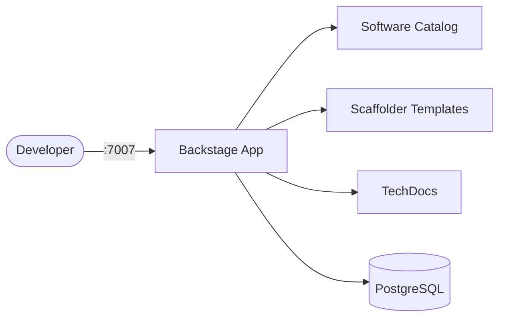

# Backstage

Backstage is an open platform for building developer portals.
It unifies infrastructure tooling, services, and documentation into a single catalog-driven UI.

Converted from `docker-compose-collections/backstage/docker-compose.yml` to Kubernetes manifests.

## How Backstage works



1. Developers access the Backstage portal via the web UI.
2. The software catalog indexes services, libraries, and infrastructure components.
3. Scaffolder templates let teams create new projects from standardized blueprints.
4. TechDocs renders markdown documentation alongside the catalog entries.
5. PostgreSQL stores catalog state, user data, and plugin metadata.

## Stack details in this repo

- Backstage image: `backstage/backstage:latest`
- Database image: `postgres:16-alpine`
- Namespace: `backstage-ns`
- Deployments: `backstage-deployment` (1 replica), `backstage-db-deployment` (1 replica)
- Services: `backstage-service` (ClusterIP `:7007`), `backstage-db-service` (ClusterIP `:5432`, internal only)
- ConfigMaps: `backstage-config` (`POSTGRES_HOST`, `POSTGRES_PORT`), `backstage-db-config`
- Secret: `backstage-secrets` (`postgres-user`, `postgres-password`, `postgres-db`)
- Persistent Volume Claim: `backstage-db-storage-claim` (5Gi, mounted at `/var/lib/postgresql/data`)
- Web UI: `http://<service-ip>:7007` (default)

### Compose mapping

| Compose service | Kubernetes resources |
| --- | --- |
| `backstage` (`backstage/backstage:latest`, port `7007`, `POSTGRES_*` env, `depends_on: db`) | `backstage-deployment` + `backstage-service`, env from `backstage-config` + `backstage-secrets` |
| `db` (`postgres:16-alpine`, volume `backstage_db`, `pg_isready` healthcheck) | `backstage-db-deployment` + `backstage-db-service` + `backstage-db-storage-claim`, `pg_isready` readiness/liveness probes |
| `backstage_db` volume | `backstage-db-storage-claim` PVC |
| `${BACKSTAGE_PORT:-7007}`, `${POSTGRES_USER:-backstage}`, `${POSTGRES_PASSWORD:-changeme}`, `${POSTGRES_DB:-backstage}` | `backstage-config` + `backstage-secrets` — edit before applying |

## Kubernetes Resources

### Namespace

```bash
kubectl apply -f namespace.yaml
```

### Secret

Create the Secret with database credentials (edit defaults before use):

```bash
kubectl apply -f secret.yaml
```

### ConfigMap

```bash
kubectl apply -f configmap.yaml
```

Edit `configmap.yaml` to change `POSTGRES_HOST` / `POSTGRES_PORT`.
Edit `secret.yaml` to change `postgres-user` / `postgres-password` / `postgres-db`.

### PersistentVolumeClaim

```bash
kubectl apply -f storage-claim.yaml
```

### Deployment

Deploys both Backstage and PostgreSQL (Backstage waits on DB via readiness probe):

```bash
kubectl apply -f deployment.yaml
```

### Service

```bash
kubectl apply -f service.yaml
```

## How to run

```bash
kubectl apply -f .
```

This will create all required resources:

- Namespace
- Secret
- ConfigMaps
- PersistentVolumeClaim
- Deployments (Backstage + PostgreSQL)
- Services (Backstage + PostgreSQL)

## Access

- Port-forward: `kubectl port-forward svc/backstage-service 7007:7007 -n backstage-ns`
- Access via: `http://localhost:7007`
- Or expose via Ingress/LoadBalancer for external access

## Use it effectively

- Register services in the software catalog using `catalog-info.yaml` files in your repos.
- Create scaffolder templates to standardize new project creation across teams.
- Enable TechDocs to render markdown docs directly in the portal.
- Add plugins for CI/CD visibility, Kubernetes, cost management, and more.

## Notes

- Change the default database password in `secret.yaml` before exposing externally.
- The official image ships with a demo catalog; customize `app-config.yaml` for your org (mount via ConfigMap/volume for production).
- PostgreSQL runs with 1 replica — do not scale it; scale only `backstage-deployment` with `kubectl scale deployment backstage-deployment --replicas=N -n backstage-ns`.
- See [Backstage docs](https://backstage.io/docs) for full configuration and plugin reference.
