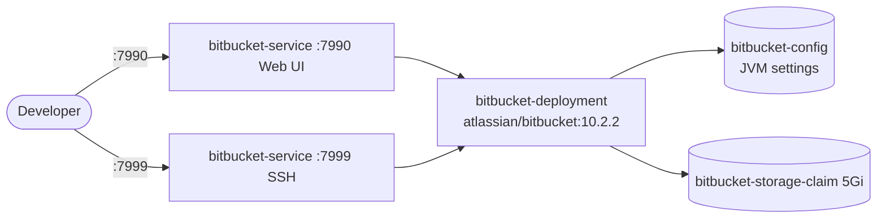

# Bitbucket

Bitbucket Server (now Bitbucket Data Center) is a self-hosted Git repository management solution by Atlassian. It provides code hosting, pull requests, branch permissions, and CI/CD integration.

## How it works



1. `bitbucket-deployment` (3 replicas) runs container `bitbucket` (`atlassian/bitbucket:10.2.2`).
2. Container exposes `7990` (`bbport`, web UI) and `7999` (`bbport2`, Git SSH).
3. `bitbucket-service` exposes port `7990` -> `targetPort: 7990` and port `7999` -> `targetPort: 7999`.
4. JVM settings come from ConfigMap `bitbucket-config` via `envFrom`.
5. Repos, config, and plugins persist in PVC `bitbucket-storage-claim` (5Gi) at `/var/atlassian/application-data/bitbucket`.
6. On first access, Bitbucket runs a setup wizard for license and admin account.

## Stack details in this repo

- Image: `atlassian/bitbucket:10.2.2`
- Namespace: `bitbucket-ns`
- Deployment: `bitbucket-deployment` (3 replicas, container `bitbucket`)
  - `containerPort: 7990` named `bbport`
  - `containerPort: 7999` named `bbport2`
  - `envFrom` ConfigMap: `bitbucket-config`
  - `volumeMounts`: `bitbucket-storage` at `/var/atlassian/application-data/bitbucket` (from PVC `bitbucket-storage-claim` via `claimName: bitbucket-storage-claim`)
- Service: `bitbucket-service` (port `7990` -> `targetPort: 7990` named `bbport`, port `7999` -> `targetPort: 7999` named `bbport2`, selector `app: bitbucket`)
- ConfigMap: `bitbucket-config` (`JVM_MINIMUM_MEMORY: 1g`, `JVM_MAXIMUM_MEMORY: 2g`, `CATALINA_OPTS: "-XX:MaxRAMPercentage=75.0"`)
- Persistent Volume Claims:
  - `bitbucket-storage-claim` (5Gi, `ReadWriteOnce`, mounted at `/var/atlassian/application-data/bitbucket`)
- Web UI: `http://<service-ip>:7990` (via Service / port-forward)
- SSH: `ssh://git@<service-ip>:7999`

## Kubernetes Resources

### Namespace

```bash
kubectl apply -f namespace.yaml
```

### PersistentVolumeClaim

```bash
kubectl apply -f storage-claim.yaml
```

### ConfigMap

Creates `bitbucket-config` with JVM tuning:

```bash
kubectl apply -f configmap.yaml
```

Edit `configmap.yaml` to adjust `JVM_MINIMUM_MEMORY` / `JVM_MAXIMUM_MEMORY` / `CATALINA_OPTS` before applying.

### Deployment

```bash
kubectl apply -f deployment.yaml
```

### Service

```bash
kubectl apply -f service.yaml
```

## How to run

```bash
kubectl apply -f .
```

This will create all required resources:

- Namespace (`bitbucket-ns`)
- PersistentVolumeClaim (`bitbucket-storage-claim`)
- ConfigMap (`bitbucket-config`)
- Deployment (`bitbucket-deployment`)
- Service (`bitbucket-service`)

## Access

- Port-forward web UI: `kubectl port-forward svc/bitbucket-service 7990:7990 -n bitbucket-ns`
- Port-forward SSH: `kubectl port-forward svc/bitbucket-service 7999:7999 -n bitbucket-ns`
- Access via: `http://localhost:7990`
- Clone via SSH (after port-forward): `git clone ssh://git@localhost:7999/<project>/<repo>.git`
- Or expose via Ingress/LoadBalancer for external access

Follow the setup wizard on first launch to configure your license and admin account.

## Notes

- Bitbucket requires a valid license (free trial available from Atlassian).
- First startup can take several minutes; check `kubectl logs -f deploy/bitbucket-deployment -n bitbucket-ns` if the UI is not immediately available.
- Allocate at least 2GB RAM — the JVM settings in `bitbucket-config` (`1g`/`2g`, `MaxRAMPercentage=75.0`) are tuned for container environments.
- The embedded database (H2) is used by default; for production, configure an external PostgreSQL database (no DB env vars are set in these manifests).
- `replicas: 3` is set in `deployment.yaml`, but Bitbucket Data Center clustering needs shared-home and DB coordination — keep `replicas: 1` unless you have configured Data Center clustering; a single `ReadWriteOnce` PVC also cannot attach to 3 pods on different nodes.
- Integrate with Jira for issue linking, configure branch permissions for code review, and use webhooks to trigger CI/CD.

## References

- Official site: <https://www.atlassian.com/enterprise/data-center/bitbucket>
- Documentation: <https://confluence.atlassian.com/spaces/BitbucketServer/pages/776639749/Bitbucket+Data+Center+documentation>
- Docker Hub image: <https://hub.docker.com/r/atlassian/bitbucket>
- YouTube — Run Atlassian Data Center Jira, Confluence, Bitbucket in docker (Alexey Matveev): <https://www.youtube.com/watch?v=xfqAwLB0OWU>
- Kubernetes documentation: <https://kubernetes.io/docs/>
