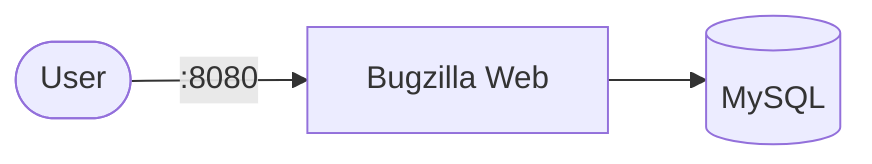

# Bugzilla

Bugzilla is an open-source issue tracking system used for tracking software bugs, feature requests, and project tasks.

This setup runs Bugzilla with a MySQL backend.

## How it works



1. User opens the Bugzilla web interface in the browser.
2. Bugzilla connects to the MySQL database service.
3. All bugs, users, and projects are stored in the database.
4. Web server serves the UI via Apache inside the container.

## Stack details in this repo

- Bug tracker image: `nasqueron/bugzilla:latest`
- Database image: `mysql:5.7`
- Namespace: `bugzilla-ns`
- Deployments: `bugzilla-deployment` (1 replica), `bugzilla-db-deployment` (1 replica)
- Services: `bugzilla-service` (ClusterIP `:8080` → `:80`), `bugzilla-db-service` (ClusterIP `:3306`, internal only)
- ConfigMaps: `bugzilla-config` (`DB_TYPE`, `DB_HOST`, `DB_DATABASE`, `DB_USER`, `BUGZILLA_URL`), `bugzilla-db-config`
- Secret: `bugzilla-secrets` (`db-password`, `mysql-root-password`, `mysql-user`, `mysql-password`, `mysql-database`)
- Persistent Volume Claim: `bugzilla-db-storage-claim` (5Gi, mounted at `/var/lib/mysql`)
- Web UI: `http://<service-ip>:8080` (default)

### Compose mapping

| Compose service | Kubernetes resources |
| --- | --- |
| `bugzilla` (port `80`, `DB_*` + `BUGZILLA_URL` env, `depends_on: db`) | `bugzilla-deployment` + `bugzilla-service` (`:8080` → `:80`), env from `bugzilla-config` + `bugzilla-secrets` |
| `db` (`mysql:5.7`, `MYSQL_*` env, `./data` bind mount) | `bugzilla-db-deployment` + `bugzilla-db-service` + `bugzilla-db-storage-claim`, `mysqladmin ping` readiness/liveness probes |
| `./data:/var/lib/mysql` bind mount | `bugzilla-db-storage-claim` PVC |
| `DB_HOST=db`, `DB_USER/PASSWORD/DATABASE`, `MYSQL_*` | `bugzilla-config` + `bugzilla-secrets` — edit before applying |

## Kubernetes Resources

### Namespace

```bash
kubectl apply -f namespace.yaml
```

### Secret

```bash
kubectl apply -f secret.yaml
```

Important: `DB_USER`/`DB_PASSWORD` must match `MYSQL_USER`/`MYSQL_PASSWORD`, and `DB_DATABASE` must match `MYSQL_DATABASE` — keep `bugzilla-config` and `bugzilla-secrets` in sync.

### ConfigMap

```bash
kubectl apply -f configmap.yaml
```

### PersistentVolumeClaim

```bash
kubectl apply -f storage-claim.yaml
```

### Deployment

```bash
kubectl apply -f deployment.yaml
```

### Service

```bash
kubectl apply -f service.yaml
```

## How to run

```bash
kubectl apply -f .
```

This will create all required resources:

- Namespace
- Secret
- ConfigMaps
- PersistentVolumeClaim (database)
- Deployments (Bugzilla + MySQL)
- Services (Bugzilla + MySQL)

## Access

- Port-forward: `kubectl port-forward svc/bugzilla-service 8080:8080 -n bugzilla-ns`
- Access via: `http://localhost:8080`
- Or expose via Ingress/LoadBalancer for external access

After installation, Bugzilla typically requires you to create an admin account during setup. If the image provides default credentials, check logs:

```bash
kubectl logs -n bugzilla-ns deploy/bugzilla-deployment
```

## Notes

- Ensure port `8080` is not used by other services.
- MySQL 5.7 is used for compatibility with Bugzilla images.
- First startup may take time due to database initialization.
- Always keep `BUGZILLA_URL` consistent with your access URL.
- MySQL runs with 1 replica — do not scale it.
