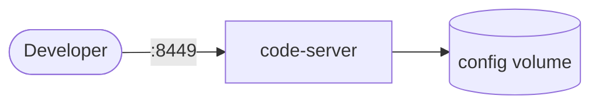

# code-server

code-server runs VS Code in the browser for remote development.

## How it works



1. The deployment starts a web-based VS Code server.
2. You authenticate using the configured password.
3. Projects are stored in the mounted `config` volume (ConfigMap).
4. Extensions/settings persist across restarts via the PersistentVolumeClaim.

## Stack details in this repo

- Image: `lscr.io/linuxserver/code-server:latest`
- Namespace: `code-server-ns`
- Deployment: `code-server-deployment`
- Service: `code-server-service`
- Persistent Volume Claim: `code-server-storage-claim`
- ConfigMap: `code-server-config`
- Web UI: `https://<host-ip>:8449` (default, via ingress or port-forward)
- Persistent data:
  - `config:/config` (via PersistentVolumeClaim)

## Kubernetes Resources

### Namespace

```bash
kubectl apply -f namespace.yaml
```

### ConfigMap

Create the ConfigMap with environment variables:

```bash
kubectl apply -f configmap.yaml
```

Edit `configmap.yaml` to set `PASSWORD` and `SUDO_PASSWORD`.

### PersistentVolumeClaim

```bash
kubectl apply -f storage-claim.yaml
```

### Deployment

```bash
kubectl apply -f deployment.yaml
```

### Service

```bash
kubectl apply -f service.yaml
```

## Environment variables

The following environment variables are configured via the ConfigMap `code-server-config`:

- `TZ` - Timezone
- `PUID` - User ID
- `PGID` - Group ID
- `PASSWORD` - code-server login password
- `SUDO_PASSWORD` - sudo password
- `DEFAULT_WORKSPACE` - Default workspace path

## How to run

```bash
kubectl apply -f .
```

This will create all required resources:

- Namespace
- ConfigMap
- PersistentVolumeClaim
- Deployment
- Service

## Access

- Port-forward: `kubectl port-forward svc/code-server-service 8449:8449 -n code-server-ns`
- Access via: `https://localhost:8449`
- Or expose via Ingress/LoadBalancer for external access

## Notes

- Access over HTTPS with a self-signed cert by default when using port-forward or ingress.
- Change default passwords before exposing publicly.
- Data persists via the PersistentVolumeClaim.
- Scale the deployment with `kubectl scale deployment code-server-deployment --replicas=N -n code-server-ns`