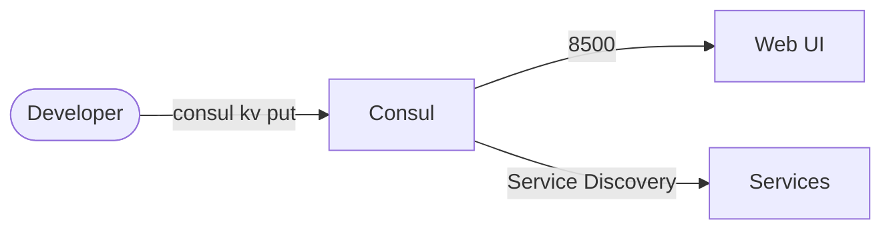

# Consul

Consul is a service networking solution to connect and configure services across any runtime platform and public or private cloud. This stack runs the official Consul container image for service discovery, service mesh, and key-value storage.

## How it works



1. Consul starts in development mode for easy testing.
2. Web UI is accessible at port 8500.
3. Use `kubectl exec` to run Consul commands.
4. Data persists via the PersistentVolumeClaim.
5. Provides service discovery, health checking, KV store, and service mesh capabilities.

## Stack details in this repo

- Image: `hashicorp/consul:latest`
- Namespace: `consul-ns`
- Deployment: `consul-deployment` (1 replica, `args: [agent, -dev, -client=0.0.0.0]`)
- Service: `consul-service` (ClusterIP `:8500` — HTTP API and Web UI)
- Persistent Volume Claim: `consul-data-storage-claim` (5Gi, mounted at `/consul/data`)

### Compose mapping

| Compose service | Kubernetes resources |
| --- | --- |
| `consul` (port `8500`, `./config` volume, `command: agent -dev -client=0.0.0.0`) | `consul-deployment` (same args) + `consul-service`, `/v1/status/leader` readiness/liveness probes |
| `./config:/consul/data` bind mount | `consul-data-storage-claim` PVC |

## Kubernetes Resources

### Namespace

```bash
kubectl apply -f namespace.yaml
```

### PersistentVolumeClaim

```bash
kubectl apply -f storage-claim.yaml
```

### Deployment

```bash
kubectl apply -f deployment.yaml
```

### Service

```bash
kubectl apply -f service.yaml
```

## How to run

```bash
kubectl apply -f .
```

This will create all required resources:

- Namespace
- PersistentVolumeClaim
- Deployment (1 replica)
- Service

## Access

- Port-forward: `kubectl port-forward svc/consul-service 8500:8500 -n consul-ns`
- Web UI: `http://localhost:8500`
- Or expose via Ingress/LoadBalancer for external access

Useful commands:

```bash
kubectl exec -n consul-ns deploy/consul-deployment -- consul members
kubectl exec -n consul-ns deploy/consul-deployment -- consul kv put mykey myvalue
kubectl exec -n consul-ns deploy/consul-deployment -- consul kv get mykey
```

## Notes

- This runs Consul in development mode, which is not suitable for production.
- For production deployments, configure a proper cluster with persistent storage.
- No ConfigMap/Secret is used — the compose stack sets no environment variables.
- Only port `8500` is exposed (matching compose); gossip/DNS ports (`8300`/`8301`/`8302`/`8600`) are container-local in dev mode.
