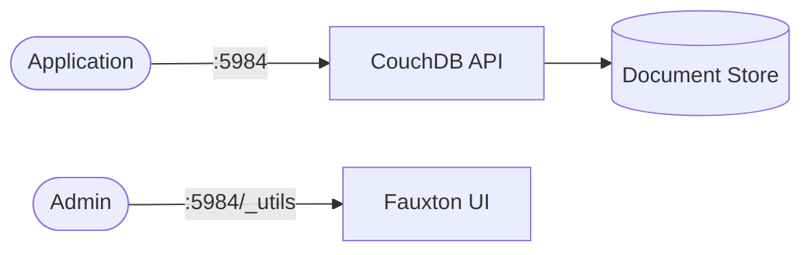

# CouchDB

Apache CouchDB is a document-oriented NoSQL database with a RESTful HTTP API.

## How it works



1. The deployment exposes a RESTful HTTP API on port 5984.
2. Applications create, read, update, and delete JSON documents via HTTP.
3. Fauxton (built-in admin UI) is available at `/_utils` for database management.
4. Data persists across restarts via the PersistentVolumeClaim.

## Stack details in this repo

- Image: `couchdb:latest`
- Namespace: `couchdb-ns`
- Deployment: `couchdb-deployment`
- Service: `couchdb-service`
- Persistent Volume Claim: `couchdb-storage-claim`
- ConfigMap: `couchdb-config`
- HTTP API / Fauxton UI: `http://<service-ip>:5984` (default)
- Persistent data:
  - `pvc/couchdb-storage-claim:/opt/couchdb/data`

## Kubernetes Resources

### Namespace

```bash
kubectl apply -f namespace.yaml
```

### ConfigMap

Create the ConfigMap with environment variables:

```bash
kubectl apply -f configmap.yaml
```

Edit `configmap.yaml` to set `COUCHDB_USER` and `COUCHDB_PASSWORD`.

### PersistentVolumeClaim

```bash
kubectl apply -f storage-claim.yaml
```

### Deployment

```bash
kubectl apply -f deployment.yaml
```

### Service

```bash
kubectl apply -f service.yaml
```

## Environment variables

The following environment variables are configured via the ConfigMap `couchdb-config`:

- `COUCHDB_USER` - CouchDB administrator username
- `COUCHDB_PASSWORD` - CouchDB administrator password

## How to run

```bash
kubectl apply -f .
```

This will create all required resources:

- Namespace
- ConfigMap
- PersistentVolumeClaim
- Deployment
- Service

## Access

- Fauxton UI: `http://localhost:5984/_utils` (via port-forward or service)
- API root: `http://localhost:5984`
- Or expose via Ingress/LoadBalancer for external access

Port-forward example:

```bash
kubectl port-forward svc/couchdb-service 5984:5984 -n couchdb-ns
```

## Notes

- Change default credentials before exposing CouchDB externally.
- CouchDB is schema-free — each document can have a different structure.
- For production clusters, configure multiple nodes with the cluster setup wizard in Fauxton.
- Data persists via the PersistentVolumeClaim.