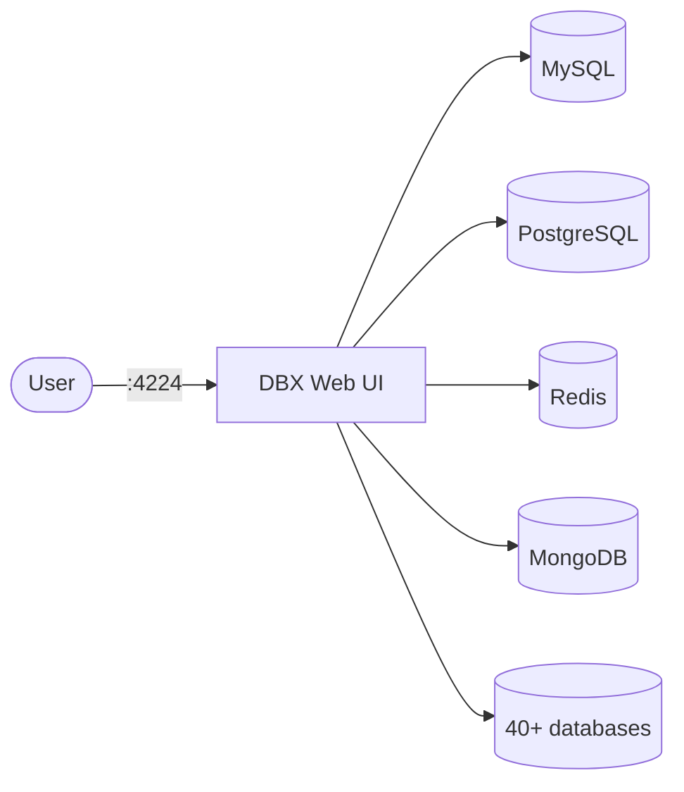

# DBX

DBX is a lightweight, cross-platform database client with web UI, supporting 40+ databases.

## How it works



1. The deployment starts a DBX web server on port 4224.
2. Connect to any supported database through the browser interface.
3. Browse tables, run SQL queries, and manage connections.
4. Data persists via the PersistentVolumeClaim.

## Stack details in this repo

- Image: `t8y2/dbx:latest`
- Namespace: `dbx-ns`
- Deployment: `dbx-deployment`
- Service: `dbx-service`
- Persistent Volume Claim: `dbx-storage-claim`
- Web UI: `http://<service-ip>:4224` (default)
- Persistent data:
  - `pvc/dbx-storage-claim:/app/data`

## Kubernetes Resources

### Namespace

```bash
kubectl apply -f namespace.yaml
```

### Deployment

```bash
kubectl apply -f deployment.yaml
```

### Service

```bash
kubectl apply -f service.yaml
```

### PersistentVolumeClaim (if needed for data persistence)

```bash
kubectl apply -f storage-claim.yaml
```

## How to run

```bash
kubectl apply -f .
```

This will create all required resources:

- Namespace
- Deployment
- Service
- PersistentVolumeClaim (optional)

## Access

- Port-forward: `kubectl port-forward svc/dbx-service 4224:4224 -n dbx-ns`
- Access via: `http://localhost:4224`
- Or expose via Ingress/LoadBalancer for external access

## Notes

- Supports 40+ database types including MySQL, PostgreSQL, Redis, MongoDB.
- Data persists via the PersistentVolumeClaim.
- Scale the deployment with `kubectl scale deployment dbx-deployment --replicas=N -n dbx-ns`