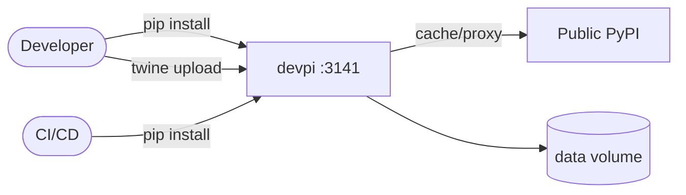

# devpi

devpi is a private Python package index and caching proxy for PyPI.

## How it works



1. The deployment starts a devpi-server and serves package index APIs.
2. You can mirror public PyPI packages and host private packages.
3. Python clients install/publish packages through devpi endpoints.
4. Package metadata and files persist via the PersistentVolumeClaim.

## Stack details in this repo

- Image: `muccg/devpi:latest`
- Namespace: `devpi`
- Deployment: `devpi`
- Service: `devpi-service` (ClusterIP)
- Persistent Volume Claim: `devpi-data`
- Endpoint: `http://<service-ip>:3141` (default)
- Persistent data:
  - `pvc/devpi-data:/data`

## Kubernetes Resources

### Namespace

```bash
kubectl apply -f namespace.yaml
```

### Deployment

```bash
kubectl apply -f deployment.yaml
```

### Service

```bash
kubectl apply -f service.yaml
```

### PersistentVolumeClaim

```bash
kubectl apply -f storage-claim.yaml
```

## How to run

```bash
kubectl apply -f .
```

This will create all required resources:

- Namespace
- Deployment
- Service
- PersistentVolumeClaim

## Access

- Port-forward: `kubectl port-forward svc/devpi-service 3141:3141 -n devpi`
- Access via: `http://localhost:3141`
- Or use `ClusterIP` for internal cluster access

## Notes

- Great for caching dependencies in CI/CD to speed builds.
- Add auth/users before production usage.
- Data persists via the PersistentVolumeClaim.