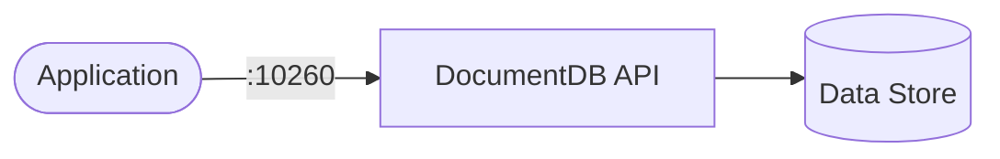

# DocumentDB

DocumentDB is a document-oriented database compatible with MongoDB API.

## How it works



1. The deployment starts a DocumentDB server.
2. Applications connect via the MongoDB-compatible API on port 10260.
3. Data persists via the PersistentVolumeClaim.

## Stack details in this repo

- Image: `ghcr.io/documentdb/documentdb/documentdb-local:latest`
- Namespace: `documentdb-ns`
- Deployment: `documentdb-deployment`
- Service: `documentdb-service`
- ConfigMap: `documentdb-config`
- Persistent Volume Claim: not explicitly defined (inline in deployment)
- API: `http://<service-ip>:10260` (default)

## Kubernetes Resources

### Namespace

```bash
kubectl apply -f namespace.yaml
```

### ConfigMap

Create the ConfigMap with environment variables:

```bash
kubectl apply -f configmap.yaml
```

Edit `configmap.yaml` to set `DOCUMENTDB_USERNAME` and `DOCUMENTDB_PASSWORD`.

### Deployment

```bash
kubectl apply -f deployment.yaml
```

### Service

```bash
kubectl apply -f service.yaml
```

## How to run

```bash
kubectl apply -f .
```

This will create all required resources:

- Namespace
- ConfigMap
- Deployment
- Service

## Access

- Port-forward: `kubectl port-forward svc/documentdb-service 10260:10260 -n documentdb-ns`
- Access via: `http://localhost:10260`
- Or expose via Ingress/LoadBalancer for external access

## Notes

- DocumentDB is MongoDB API compatible.
- Default credentials: admin/admin (change before exposing publicly).
- Data persistence can be added via a PersistentVolumeClaim.