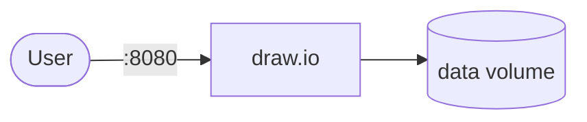

# draw.io

draw.io is a diagramming tool for creating technical and business diagrams in the browser.

## How it works



1. The deployment starts a draw.io server.
2. Create and edit diagrams via the web interface.
3. Diagrams are stored in the mounted `data` volume.
4. Extensions and configurations persist across restarts.

## Stack details in this repo

- Image: `jgraph/drawio`
- Namespace: `draw-io-ns`
- Deployment: `draw-io-deployment`
- Service: `draw-io-service`
- Persistent Volume Claim: `draw-io-storage-claim`
- Ports: `8080` (HTTP) and `8443` (HTTPS)
- Persistent data:
  - `pvc/draw-io-storage-claim:/data`

## Kubernetes Resources

### Namespace

```bash
kubectl apply -f namespace.yaml
```

### Deployment

```bash
kubectl apply -f deployment.yaml
```

### Service

```bash
kubectl apply -f service.yaml
```

### PersistentVolumeClaim

```bash
kubectl apply -f storage-claim.yaml
```

## How to run

```bash
kubectl apply -f .
```

This will create all required resources:

- Namespace
- Deployment
- Service
- PersistentVolumeClaim

## Access

- Port-forward HTTP: `kubectl port-forward svc/draw-io-service 8080:8080 -n draw-io-ns`
- Port-forward HTTPS: `kubectl port-forward svc/draw-io-service 8443:8443 -n draw-io-ns`
- Access via: `http://localhost:8080` or `https://localhost:8443`
- Or expose via Ingress/LoadBalancer for external access

## Notes

- Diagrams persist via the PersistentVolumeClaim.
- Multiple replicas support horizontal scaling.
- Access over HTTPS with a valid certificate is recommended for production use.