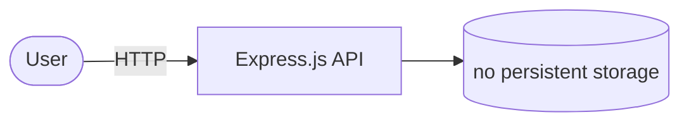

# express-ts-sample

A sample Express.js TypeScript application demonstrating containerized backend development with Kubernetes.

## How it works



1. The deployment starts an Express.js TypeScript backend service.
2. Exposes a RESTful API via HTTP.
3. Stateless container - no persistent storage.
4. Designed for development and testing of TypeScript Express applications.

## Stack details in this repo

- Image: `ghcr.io/marcuwynu23/express-typescript-sample:latest`
- Namespace: `k8s-collections`
- Deployment: `express-ts-sample` (1 replica)
- Service: `express-ts-sample-svc` (NodePort)
- Ports: `3000` (container) and `30080` (NodePort)
- No Persistent Volume Claim (stateless application)

## Kubernetes Resources

### Deployment

```bash
kubectl apply -f deployment.yaml
```

### Service

```bash
kubectl apply -f service.yaml
```

## How to run

```bash
kubectl apply -f .
```

This will create the required resources:

- Deployment (1 replica)
- Service (NodePort)

## Access

- NodePort: `http://<node-ip>:30080` (default)
- Port-forward: `kubectl port-forward svc/express-ts-sample-svc 8080:80 -n k8s-collections`
- Access via: `http://localhost:8080`

## Notes

- Stateless application - no data persistence between restarts.
- Designed for development and testing purposes.
- Update the image tag to deploy newer versions.
- Scale the deployment with `kubectl scale deployment express-ts-sample --replicas=N -n k8s-collections`
- CORS and API configuration may need adjustment for production use.