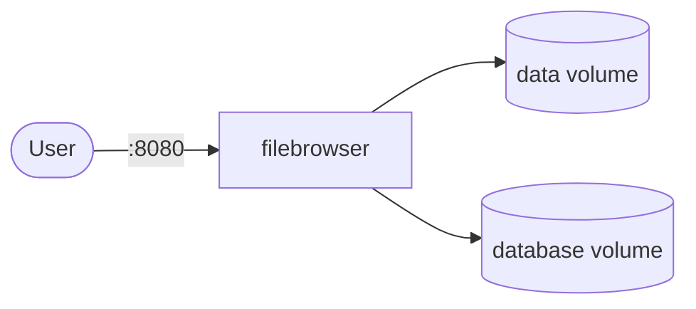

# filebrowser

filebrowser is a web-based file manager that allows you to upload, delete, preview, and edit files directly in the browser.

## How it works



1. The deployment starts a filebrowser server.
2. Manage files and directories via the web UI.
3. Data and database persist across restarts via PersistentVolumeClaims.

## Stack details in this repo

- Image: `filebrowser/filebrowser:latest`
- Namespace: `filebrowser-ns`
- Deployment: `filebrowser-deployment`
- Service: `filebrowser-service`
- ConfigMap: `filebrowser-config`
- Persistent Volume Claims: `filebrowser-data-pvc`, `filebrowser-database-pvc`
- Port: `8080` (default)
- Persistent data:
  - `pvc/filebrowser-data-pvc:/srv` (file storage)
  - `pvc/filebrowser-database-pvc:/database` (metadata)

## Kubernetes Resources

### Namespace

```bash
kubectl apply -f namespace.yaml
```

### ConfigMap

Create the ConfigMap with environment variables:

```bash
kubectl apply -f configmap.yaml
```

Edit `configmap.yaml` to set `FB_PORT` if needed.

### PersistentVolumeClaims

```bash
kubectl apply -f storage-claim.yaml
```

This creates two PVCs: `filebrowser-data-pvc` and `filebrowser-database-pvc`.

### Deployment

```bash
kubectl apply -f deployment.yaml
```

### Service

```bash
kubectl apply -f service.yaml
```

## How to run

```bash
kubectl apply -f .
```

This will create all required resources:

- Namespace
- ConfigMap
- Two PersistentVolumeClaims
- Deployment
- Service

## Access

- Port-forward: `kubectl port-forward svc/filebrowser-service 8080:8080 -n filebrowser-ns`
- Access via: `http://localhost:8080`
- Or expose via Ingress/LoadBalancer for external access

## Notes

- File storage persists via `filebrowser-data-pvc`.
- Database metadata persists via `filebrowser-database-pvc`.
- Configure proper access controls before exposing publicly.