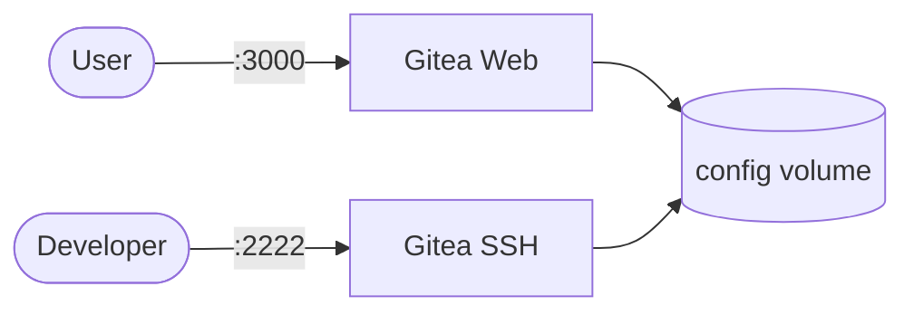

# Gitea

Gitea is a lightweight self-hosted Git service with web UI and SSH access.

## How it works



1. The deployment starts a Gitea server.
2. Repository data and configuration are stored in the `config` volume (PersistentVolumeClaim).
3. Users interact via browser (UI/API) or git over SSH/HTTP.
4. UID/GID environment values control file ownership compatibility.

## Stack details in this repo

- Image: `gitea/gitea:latest`
- Namespace: `gitea`
- Deployment: `gitea-server`
- Service: `gitea-service` (NodePort)
- Persistent Volume Claim: `gitea-data`
- ConfigMap: `gitea-config`
- Web UI: `http://<node-ip>:3000` (default, via NodePort)
- SSH: `ssh://<node-ip>:32222` (default, via NodePort)
- Persistent data:
  - `pvc/gitea-data:/data` (via PersistentVolumeClaim)

## Kubernetes Resources

### Namespace

```bash
kubectl apply -f namespace.yaml
```

### ConfigMap

Create the ConfigMap with environment variables:

```bash
kubectl apply -f configmap.yaml
```

Edit `configmap.yaml` to set `USER_UID` and `USER_GID`.

### PersistentVolumeClaim

```bash
kubectl apply -f storage-claim.yaml
```

### Deployment

```bash
kubectl apply -f deployment.yaml
```

### Service

```bash
kubectl apply -f service.yaml
```

## Environment variables

The following environment variables are configured via the ConfigMap `gitea-config`:

- `USER_UID` - User ID for file ownership
- `USER_GID` - Group ID for file ownership

## How to run

```bash
kubectl apply -f .
```

This will create all required resources:

- Namespace
- ConfigMap
- PersistentVolumeClaim
- Deployment
- Service

## Access

- Port-forward HTTP: `kubectl port-forward svc/gitea-service 3000:3000 -n gitea`
- Port-forward SSH: `kubectl port-forward svc/gitea-service 32222:22 -n gitea`
- Access via: `http://localhost:3000`
- SSH: `ssh://git@localhost:32222`

Or expose via Ingress/LoadBalancer for external access.

## Notes

- Use `ssh://git@<node-ip>:32222/<owner>/<repo>.git` for SSH clone/push.
- Data persists via the PersistentVolumeClaim.
- Scale the deployment with `kubectl scale deployment gitea-server --replicas=N -n gitea`