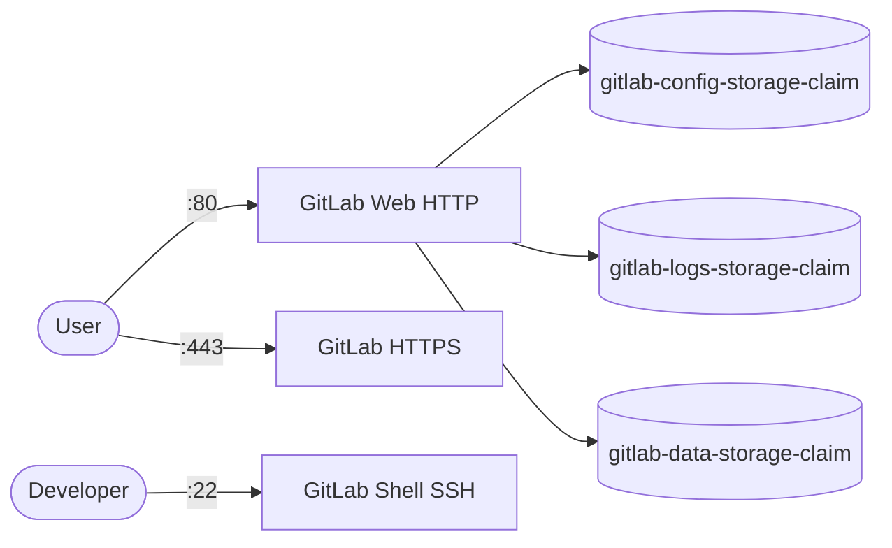

# GitLab

GitLab EE is a self-hosted DevOps platform for Git repository management, code review, CI/CD, and issue tracking.

## How it works



1. The deployment starts a single GitLab Omnibus server (`replicas: 1` — GitLab does not scale horizontally this way).
2. Omnibus is configured via ConfigMap `gitlab-config` (`external_url`, `gitlab_shell_ssh_port`).
3. Config, logs, and application data persist in three PVCs mounted at `/etc/gitlab`, `/var/log/gitlab`, and `/var/opt/gitlab`.
4. `/dev/shm` is backed by a 256Mi memory `emptyDir` (mirrors `shm_size: 256m` from Docker Compose).
5. Service `gitlab-service` exposes HTTP (`80`), HTTPS (`443`), and SSH (`22`) inside the cluster.

## Stack details in this repo

- Image: `gitlab/gitlab-ee:latest`
- Namespace: `gitlab-ns`
- Deployment: `gitlab-deployment`
- Service: `gitlab-service` (ClusterIP)
- ConfigMap: `gitlab-config`
- Persistent Volume Claims:
  - `gitlab-config-storage-claim` (5Gi) -> `/etc/gitlab`
  - `gitlab-logs-storage-claim` (5Gi) -> `/var/log/gitlab`
  - `gitlab-data-storage-claim` (10Gi) -> `/var/opt/gitlab`
- Web UI: `http://<cluster-ip>:80` (via Service / port-forward)
- SSH: `ssh://<cluster-ip>:22` (via Service / port-forward)

## Kubernetes Resources

### Namespace

```bash
kubectl apply -f namespace.yaml
```

### PersistentVolumeClaims

```bash
kubectl apply -f storage-claim.yaml
```

### ConfigMap

Create the ConfigMap with Omnibus settings:

```bash
kubectl apply -f configmap.yaml
```

Edit `configmap.yaml` to set `external_url` if exposing GitLab on a real hostname.

### Deployment

```bash
kubectl apply -f deployment.yaml
```

### Service

```bash
kubectl apply -f service.yaml
```

## Environment variables

The following is configured via the ConfigMap `gitlab-config` (`GITLAB_OMNIBUS_CONFIG`):

- `external_url 'http://0.0.0.0'`
- `gitlab_rails['gitlab_shell_ssh_port'] = 2222`

## How to run

```bash
kubectl apply -f .
```

This will create all required resources:

- Namespace
- PersistentVolumeClaims
- ConfigMap
- Deployment
- Service

## Access

- Port-forward HTTP: `kubectl port-forward svc/gitlab-service 8084:80 -n gitlab-ns`
- Port-forward HTTPS: `kubectl port-forward svc/gitlab-service 8443:443 -n gitlab-ns`
- Port-forward SSH: `kubectl port-forward svc/gitlab-service 2222:22 -n gitlab-ns`
- Access via: `http://localhost:8084`
- SSH: `ssh://git@localhost:2222`

Get the initial `root` password (auto-generated on first boot, removed after 24h):

```bash
kubectl exec -it deploy/gitlab-deployment -n gitlab-ns -- grep 'Password:' /etc/gitlab/initial_root_password
```

Then log in as `root` with that password.

Or expose via Ingress/LoadBalancer for external access (update `external_url` first, then `kubectl exec -it deploy/gitlab-deployment -n gitlab-ns -- gitlab-ctl reconfigure`).

## Notes

- First startup can take 5-10 minutes; check `kubectl logs -f deploy/gitlab-deployment -n gitlab-ns` if the UI is not immediately available.
- Allocate at least 4GB RAM — GitLab Omnibus is memory-heavy and will be slow or crash on small nodes.
- Keep `replicas: 1` — use GitLab Geo / reference architectures for HA instead of scaling this Deployment.
- This uses the EE (`Enterprise Edition`) image; it runs free with CE features unless you add a license.
- Consider pinning the image tag (e.g. `gitlab/gitlab-ee:17.x-ee.0`) for reproducible upgrades instead of `latest`.
- Data persists via the three PersistentVolumeClaims.

## References

- Official site: <https://about.gitlab.com>
- Documentation: <https://docs.gitlab.com>
- Omnibus Docker docs: <https://docs.gitlab.com/omnibus/docker/>
- Docker Hub image: <https://hub.docker.com/r/gitlab/gitlab-ee>

## Self-hosted alternatives in this collection

If GitLab feels too heavy, try a lighter Git host:

- [Gitea](../gitea/) — lightweight self-hosted Git service, low resource use.
- [Bitbucket](../bitbucket/) — Atlassian self-hosted Git with Jira integration.
