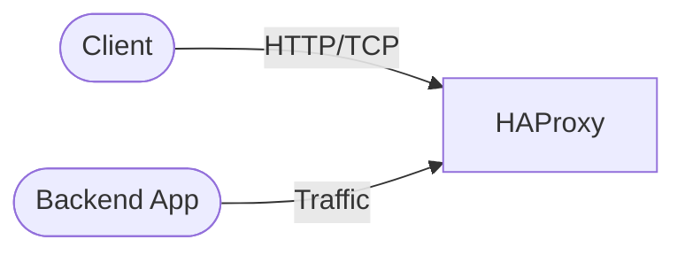

# haproxy

HAProxy is a high-performance TCP/HTTP load balancer and proxy server.

## How it works



1. The deployment starts an HAProxy load balancer.
2. Distributes incoming HTTP/TCP traffic to backend services.
3. Built-in statistics dashboard available on port 8404.
4. Configuration is stored in a ConfigMap and mounted as a file.

## Stack details in this repo

- Image: `haproxy:2.9-alpine`
- Namespace: `haproxy-ns`
- Deployment: `haproxy-deployment` (2 replicas by default)
- Service: `haproxy-service`
- ConfigMap: `haproxy-config`
- Ports: `80` (HTTP) and `8404` (Stats)
- Configuration: mounted from ConfigMap `haproxy-config`

## Kubernetes Resources

### Namespace

```bash
kubectl apply -f namespace.yaml
```

### ConfigMap

Create the ConfigMap with HAProxy configuration:

```bash
kubectl apply -f configmap.yaml
```

Edit `configmap.yaml` to update the `haproxy.cfg` data for your backend services.

### Deployment

```bash
kubectl apply -f deployment.yaml
```

### Service

```bash
kubectl apply -f service.yaml
```

## How to run

```bash
kubectl apply -f .
```

This will create all required resources:

- Namespace
- ConfigMap
- Deployment (2 replicas)
- Service

## Access

- HTTP traffic: port 8080 (via service) or port-forward `kubectl port-forward svc/haproxy-service 8080:80 -n haproxy-ns`
- Statistics dashboard: port 8404 (via service) or port-forward `kubectl port-forward svc/haproxy-service 8404:8404 -n haproxy-ns`
- Or expose via Ingress/LoadBalancer for external access

## Notes

- 2 replicas are deployed by default for high availability.
- Configuration is stored in a ConfigMap and mounted as a read-only file.
- Stats dashboard available at `http://<haproxy-ip>:8404/stats`.
- Update the ConfigMap to change backend servers or load balancing algorithm.