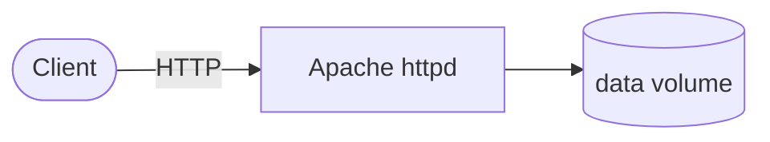

# httpd

Apache HTTP Server (httpd) is a popular web server.

## How it works



1. The deployment starts an Apache httpd web server.
2. Serves static HTML content and handles HTTP requests.
3. Content is stored in a ConfigMap and mounted via PersistentVolumeClaim.

## Stack details in this repo

- Image: `httpd:trixie`
- Namespace: `k8s-collections`
- Deployment: `httpd-deployment` (3 replicas by default)
- Service: `httpd-service` (NodePort)
- ConfigMap: `httpd-html`
- Persistent Volume Claim: `httpd-pvc`
- Ports: `80` (HTTP) and `30080` (NodePort)
- Configuration: HTML content stored in ConfigMap `httpd-html`

## Kubernetes Resources

### Namespace

```bash
kubectl apply -f namespace.yaml
```

### ConfigMap

Create the ConfigMap with HTML content:

```bash
kubectl apply -f configmap.yaml
```

Edit `configmap.yaml` to update the `index.html` data.

### PersistentVolumeClaim

```bash
kubectl apply -f pvc.yaml
```

### Deployment

```bash
kubectl apply -f deployment.yaml
```

### Service

```bash
kubectl apply -f service.yaml
```

## How to run

```bash
kubectl apply -f .
```

This will create all required resources:

- Namespace
- ConfigMap
- PersistentVolumeClaim
- Deployment (3 replicas)
- Service (NodePort)

## Access

- NodePort: `http://<node-ip>:30080` (default)
- Port-forward: `kubectl port-forward svc/httpd-service 8080:80 -n k8s-collections`
- Or expose via Ingress/LoadBalancer for external access

## Notes

- 3 replicas are deployed by default.
- HTML content is stored in ConfigMap `httpd-html`.
- Persistent data is stored in `httpd-pvc` with hostpath storage class.
- Update the ConfigMap to change the served web content.