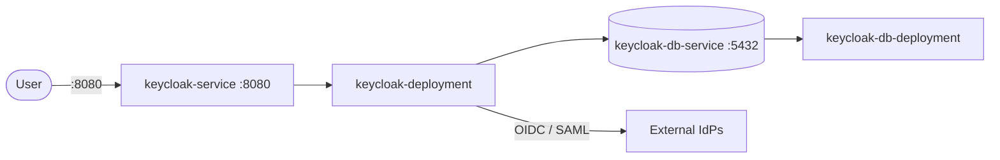

# Keycloak

Keycloak is an open-source identity and access management solution.
It provides SSO, user federation, social login, and fine-grained authorization out of the box.

## How it works



1. Users authenticate through `keycloak-deployment` (`quay.io/keycloak/keycloak:25.0`) exposed by `keycloak-service` on `:8080`.
2. Keycloak issues tokens (JWT) that applications validate for access control.
3. Realms isolate tenants; clients represent applications registered with Keycloak.
4. User federation connects to LDAP, Active Directory, or external identity providers.
5. `keycloak-db-deployment` (`postgres:16-alpine`) behind `keycloak-db-service` (`:5432`, internal only) stores realm configuration, users, sessions, and credentials.

## Stack details in this repo

- Image: `quay.io/keycloak/keycloak:25.0`
- Database image: `postgres:16-alpine`
- Namespace: `keycloak-ns`
- Deployments:
  - `keycloak-deployment` (3 replicas, container `keycloak`, `containerPort: 8080` (`http`), `envFrom: keycloak-config`)
  - `keycloak-db-deployment` (3 replicas, container `keycloak-db`, `containerPort: 5432` (`postgresql-port`), `envFrom: keycloak-db-config`, volume mount `/var/lib/postgresql/data` -> `keycloak-db-storage-claim`)
- Services:
  - `keycloak-service` (ClusterIP `:8080` -> `8080`)
  - `keycloak-db-service` (ClusterIP `:5432` -> `5432`, internal only)
- ConfigMaps:
  - `keycloak-config` (`KEYCLOAK_ADMIN`, `KEYCLOAK_ADMIN_PASSWORD`, `KC_DB`, `KC_DB_URL`, `KC_DB_USERNAME`, `KC_DB_PASSWORD`)
  - `keycloak-db-config` (`POSTGRES_USER`, `POSTGRES_PASSWORD`, `POSTGRES_DB`)
- Persistent Volume Claims:
  - `keycloak-db-storage-claim` (5Gi, mounted at `/var/lib/postgresql/data` on `keycloak-db-deployment`)
- Web UI: `http://<service-ip>:8080` (default)

## Kubernetes Resources

### Namespace

```bash
kubectl apply -f namespace.yaml
```

### ConfigMap

```bash
kubectl apply -f configmap.yaml
```

Edit `configmap.yaml` to change `KEYCLOAK_ADMIN` / `KEYCLOAK_ADMIN_PASSWORD` in `keycloak-config`, or `POSTGRES_USER` / `POSTGRES_PASSWORD` / `POSTGRES_DB` in `keycloak-db-config`. Note `KC_DB_URL` (`jdbc:postgresql://db:5432/keycloak`) must match the database service and credentials.

### PersistentVolumeClaim

```bash
kubectl apply -f storage-claim.yaml
```

### Deployment

Deploys Keycloak and PostgreSQL (Keycloak reaches the database via the ClusterIP service):

```bash
kubectl apply -f deployment.yaml
```

### Service

```bash
kubectl apply -f service.yaml
```

## How to run

```bash
kubectl apply -f .
```

This will create all required resources:

- Namespace (`keycloak-ns`)
- ConfigMaps (`keycloak-config`, `keycloak-db-config`)
- PersistentVolumeClaim (`keycloak-db-storage-claim`)
- Deployments (`keycloak-deployment`, `keycloak-db-deployment`)
- Services (`keycloak-service`, `keycloak-db-service`)

## Access

- Port-forward: `kubectl port-forward svc/keycloak-service 8080:8080 -n keycloak-ns`
- Access via: `http://localhost:8080`
- Or expose via Ingress/LoadBalancer for external access

## Notes

- Change default admin credentials (`KEYCLOAK_ADMIN` / `KEYCLOAK_ADMIN_PASSWORD` in `keycloak-config`, and `POSTGRES_*` in `keycloak-db-config`) before exposing Keycloak externally.
- The manifests use development-mode defaults (`changeme` passwords). For production, move secrets to a `Secret` and configure TLS / `start` instead of `start-dev` behaviour.
- PostgreSQL data persists via `keycloak-db-storage-claim` (5Gi) at `/var/lib/postgresql/data`; Keycloak itself is stateless in these manifests.
- `keycloak-db-service` (`:5432`) is internal only — do not expose it externally unless required.

## References

- Official site: <https://www.keycloak.org>
- Documentation: <https://www.keycloak.org/documentation>
- GitHub repo: <https://github.com/keycloak/keycloak>
- YouTube — Keycloak + Docker Compose: Setup & Authentication Tutorial (Rayan Slim): <https://www.youtube.com/watch?v=WGcgiegv0W0>
- Kubernetes documentation: <https://kubernetes.io/docs/>
