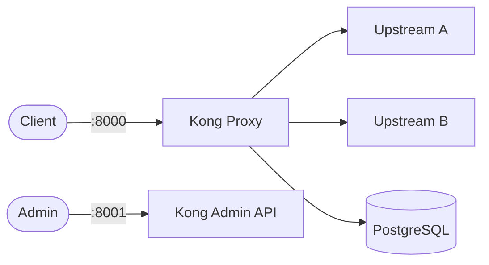

# Kong

Kong is a cloud-native API gateway and platform for managing, securing, and observing APIs and microservices.
It provides rate limiting, authentication, load balancing, and plugin-based extensibility.

## How Kong works



1. Clients send requests to the Kong proxy port (8000/8443).
2. Kong matches routes and forwards traffic to configured upstream services.
3. Plugins (auth, rate-limit, logging, etc.) execute on each request.
4. The Admin API (port 8001) manages routes, services, consumers, and plugins.
5. PostgreSQL stores all Kong configuration and plugin state.

## Stack details in this repo

- **Kong image**: `kong:3.7`
- **Database image**: `postgres:16-alpine`
- **Database**: Persistent volumes via `storage-claim.yaml` (5Gi PVC)
- **Migration**: `Job` resource running `kong migrations bootstrap` (one-time execution)
- **Proxy port**: `8000` (HTTP), `8443` (HTTPS)
- **Admin API**: `http://<host-ip>:8001`
- **PostgreSQL**: Internal-only ClusterIP service (`kong-database`), data persisted via PVC

## Kubernetes Resources

This repository contains all manifests needed to deploy Kong on Kubernetes:

### Namespaces
- `kong-ns` — dedicated namespace for all Kong resources

### ConfigMaps
- `kong-config` — Kong environment variables (`KONG_DATABASE`, `KONG_PG_HOST`, etc.)
- `kong-db-config` — PostgreSQL settings (`POSTGRES_USER`, `POSTGRES_DB`)
- `kong-migr-config` — Migration environment variables

### Secrets
- `kong-secret` — Kong configuration (`KONG_PG_PASSWORD`)
- `kong-db-secret` — PostgreSQL password (`POSTGRES_PASSWORD`)

### Deployments
- **`kong-deployment`** — 3 replicas of `kong:3.7` with `livenessProbe`/`readinessProbe` (HTTP GET /status on port http-admin)
- **`kong-db-deployment`** — 1 replica of `postgres:16-alpine` with health probes (`pg_isready`), PVC storage, and environment from ConfigMap + Secret

### Jobs
- **`kong-migr`** — One-time `Job` that runs `kong migrations bootstrap` with `restartPolicy: OnFailure` and `backoffLimit: 4`
- Executes database schema migrations on first start, then exits

### Services
- **`kong-service`** — ClusterIP exposing ports 8000/8443/8001 to Kong proxy/admin
- **`kong-database`** — ClusterIP service on port 5432 for PostgreSQL internal connectivity (selector: `app: kong-db`)

### PersistentVolumeClaim
- **`kong-storage-claim`** — 5Gi `ReadWriteOnce` claim for PostgreSQL data persistence

## Environment variables

Environment is injected via ConfigMaps and Secrets at deployment time:

### `kong-config` ConfigMap (mounted via `envFrom`)
- `KONG_DATABASE` (default: `postgres`)
- `KONG_PG_HOST` (default: `kong-database`)
- `KONG_PG_USER` (default: `kong`)
- `KONG_PG_PASSWORD` — sourced from `kong-secret` (value: `changeme`)
- `KONG_PG_DATABASE` (default: `kong`)
- `KONG_PROXY_ACCESS_LOG` (default: `/dev/stdout`)
- `KONG_ADMIN_ACCESS_LOG` (default: `/dev/stdout`)
- `KONG_PROXY_ERROR_LOG` (default: `/dev/stderr`)
- `KONG_ADMIN_ERROR_LOG` (default: `/dev/stderr`)
- `KONG_ADMIN_LISTEN` (default: `0.0.0.0:8001`)

### `kong-db-config` ConfigMap (mounted via `envFrom`)
- `POSTGRES_USER` (default: `kong`)
- `POSTGRES_DB` (default: `kong`)
- `POSTGRES_PASSWORD` — sourced from `kong-db-secret` (value: `changeme`)

### `kong-migr-config` ConfigMap (mounted via `envFrom`)
- `KONG_DATABASE` (default: `postgres`)
- `KONG_PG_HOST` (default: `kong-database`)
- `KONG_PG_USER` (default: `kong`)
- `KONG_PG_PASSWORD` — sourced from `kong-secret` (value: `changeme`)
- `KONG_PG_DATABASE` (default: `kong`)

### Secrets
- `kong-db-secret` provides `POSTGRES_PASSWORD` for the database deployment
- `kong-secret` provides `KONG_PG_PASSWORD` for the Kong deployment

## Deploying to Kubernetes

From the repository root:

```bash
kubectl apply -R -f .
```

This will create all resources in the `kong-ns` namespace:
- Namespace, ConfigMaps, Secrets
- Database Deployment + PVC + Service
- Kong Deployment + Service
- Migration Job (runs once, then completes)

### Verify deployment:

```bash
kubectl get all -n kong-ns
```

### Check migration status:

```bash
kubectl get job kong-migr -n kong-ns
kubectl logs job/kong-migr -n kong-ns
```

### Verify database is ready:

```bash
kubectl port-forward svc/kong-database 5432:5432 -n kong-ns
# Then: psql -h localhost -U kong -d kong
```

### Access Kong:

```bash
kubectl port-forward svc/kong-service 8000:8000 8443:8443 8001:8001 -n kong-ns
```

Then:

```bash
curl http://localhost:8001/status
```

Open:

- Proxy: `http://localhost:8000`
- Admin API: `http://localhost:8001`

## Post-deployment setup

### Run migrations (if not using the Job)

If you need to re-run migrations manually:

```bash
kubectl port-forward svc/kong-database 5432:5432 -n kong-ns
kubectl run --rm -i tmp-migr --image=kong:3.7 --restart=Never -- kong migrations bootstrap
```

### Enable plugins via Admin API:

```bash
# Create a service
curl -i -X POST http://localhost:8001/services \
  --data name=example-service \
  --data url=http://httpbin.org

# Create a route
curl -i -X POST http://localhost:8001/services/example-service/routes \
  --data paths[]=/example

# Enable key-auth plugin
curl -i -X POST http://localhost:8001/services/example-service/plugins \
  --data name=key-auth
```

### Useful kubectl commands:

```bash
kubectl get pods -n kong-ns
kubectl get svc -n kong-ns
kubectl logs deployment/kong-deployment -n kong-ns
kubectl logs job/kong-migr -n kong-ns
kubectl describe pod -l app=kong-db -n kong-ns
kubectl describe job kong-migr -n kong-ns
kubectl port-forward svc/kong-service 8000:8000 8443:8443 8001:8001 -n kong-ns
kubectl port-forward svc/kong-database 5432:5432 -n kong-ns
```

## Notes

- **Database credentials**: Change default passwords (`changeme`) before exposing externally
- **Migration**: The `kong-migr` Job runs once on first deployment and exits — this is expected behavior
- **Persistence**: PostgreSQL data is stored in a 5Gi PVC; backing storage must be provisioned for production
- **Admin API**: Should not be exposed publicly in production; restrict via firewall or `NodePort`/`Ingress` with auth
- **Kong replicas**: 3 replicas deployed for high availability; scale up/down via `kubectl scale deployment kong-deployment --replicas=N -n kong-ns`
- **Health probes**: Both DB and Kong have liveness/readiness/startup probes to ensure traffic only routes to healthy instances
- **DNS**: Database service renamed to `kong-database` to match `KONG_PG_HOST` ConfigMap value for correct service discovery