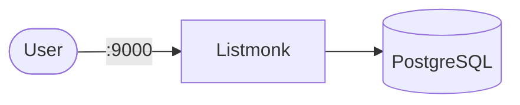

# Listmonk

Listmonk is a self-hosted newsletter and mailing list manager.

## How it works



1. Listmonk provides a web UI for managing subscribers and campaigns.
2. PostgreSQL stores subscribers, templates, and campaign data.
3. The container runs install → upgrade → serve on startup (first boot initializes the schema).
4. The dashboard is exposed on port `9000`.

## Stack details in this repo

- Listmonk image: `listmonk/listmonk:nightly`
- Database image: `postgres:15-alpine`
- Namespace: `listmonk-ns`
- Deployments: `listmonk-deployment` (1 replica), `listmonk-db-deployment` (1 replica)
- Services: `listmonk-service` (ClusterIP `:9000`), `listmonk-db-service` (ClusterIP `:5432`, internal only)
- ConfigMap: `listmonk-db-config` (`POSTGRES_USER`, `POSTGRES_DB`)
- Secret: `listmonk-secrets` (`postgres-user`, `postgres-password`, `postgres-db`, plus `config.toml`)
- Persistent Volume Claim: `listmonk-db-storage-claim` (5Gi, mounted at `/var/lib/postgresql/data`)
- UI endpoint: `http://<service-ip>:9000` (default)

### Compose mapping

| Compose service | Kubernetes resources |
| --- | --- |
| `listmonk` (port `9000`, `./config/config.toml` mount, install/upgrade/run command chain, waits for db) | `listmonk-deployment` (same command chain) + `listmonk-service` |
| `./config/config.toml` file mount | `config.toml` key in `listmonk-secrets`, mounted at `/listmonk/config.toml` via `subPath` (kept in Secret because it embeds the DB password; host rewritten to `listmonk-db-service`) |
| `db` (`postgres:15-alpine`, `postgres_data` volume, `pg_isready` healthcheck) | `listmonk-db-deployment` + `listmonk-db-service` + `listmonk-db-storage-claim`, `pg_isready` probes |
| `postgres_data` volume | `listmonk-db-storage-claim` PVC |

## Kubernetes Resources

### Namespace

```bash
kubectl apply -f namespace.yaml
```

### Secret

```bash
kubectl apply -f secret.yaml
```

Important: the credentials inside `config.toml` must match `postgres-user`/`postgres-password`/`postgres-db` — keep them in sync when editing.

### ConfigMap

```bash
kubectl apply -f configmap.yaml
```

### PersistentVolumeClaim

```bash
kubectl apply -f storage-claim.yaml
```

### Deployment

```bash
kubectl apply -f deployment.yaml
```

### Service

```bash
kubectl apply -f service.yaml
```

## How to run

```bash
kubectl apply -f .
```

This will create all required resources:

- Namespace
- Secret (including `config.toml`)
- ConfigMap
- PersistentVolumeClaim (database)
- Deployments (Listmonk + PostgreSQL)
- Services (Listmonk + PostgreSQL)

## Access

- Port-forward: `kubectl port-forward svc/listmonk-service 9000:9000 -n listmonk-ns`
- Access via: `http://localhost:9000`
- Or expose via Ingress/LoadBalancer for external access

## Notes

- First startup initializes the database schema (`--install --idempotent`).
- Configure your SMTP settings in the admin UI (Settings → SMTP) for sending newsletters.
- Change default credentials in `secret.yaml` (both the keys and inside `config.toml`) before exposing externally.
- PostgreSQL runs with 1 replica — do not scale it.
