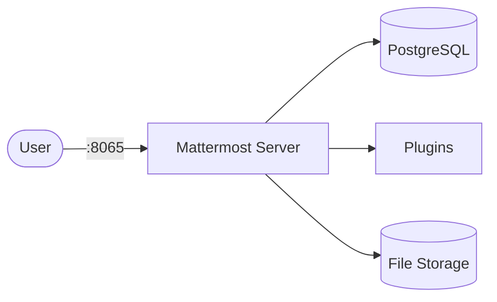

# Mattermost

Mattermost is a self-hosted team messaging platform — an open-source alternative to Slack.
It provides channels, direct messages, file sharing, integrations, and plugin support.

## How Mattermost works



1. Mattermost serves the web UI and API on port 8065.
2. PostgreSQL stores users, channels, messages, and configuration.
3. File uploads and attachments persist in the data volume.
4. Plugins and integrations extend functionality (webhooks, bots, slash commands).

## Stack details in this repo

- Mattermost image: `mattermost/mattermost-team-edition:latest`
- Database image: `postgres:16-alpine`
- Namespace: `mattermost-ns`
- Deployments: `mattermost-deployment` (1 replica), `mattermost-db-deployment` (1 replica)
- Services: `mattermost-service` (ClusterIP `:8065`), `mattermost-db-service` (ClusterIP `:5432`, internal only)
- ConfigMaps: `mattermost-config` (`MM_SQLSETTINGS_DRIVERNAME`), `mattermost-db-config`
- Secret: `mattermost-secrets` (`postgres-user`, `postgres-password`, `postgres-db`, `datasource`)
- Persistent Volume Claims:
  - `mattermost-data-storage-claim` (5Gi, mounted at `/mattermost/data`)
  - `mattermost-logs-storage-claim` (2Gi, mounted at `/mattermost/logs`)
  - `mattermost-config-storage-claim` (1Gi, mounted at `/mattermost/config`)
  - `mattermost-plugins-storage-claim` (2Gi, mounted at `/mattermost/plugins`)
  - `mattermost-db-storage-claim` (5Gi, mounted at `/var/lib/postgresql/data`)
- Web UI: `http://<service-ip>:8065` (default)

### Compose mapping

| Compose service | Kubernetes resources |
| --- | --- |
| `mattermost` (port `8065`, `MM_SQLSETTINGS_*` env, `depends_on: db`, 4 app volumes) | `mattermost-deployment` + `mattermost-service`, env from `mattermost-config` + `mattermost-secrets` |
| `db` (`postgres:16-alpine`, `mattermost_db` volume, `pg_isready` healthcheck) | `mattermost-db-deployment` + `mattermost-db-service` + `mattermost-db-storage-claim`, `pg_isready` readiness/liveness probes |
| `mattermost_data`, `mattermost_logs`, `mattermost_config`, `mattermost_plugins`, `mattermost_db` volumes | matching PVCs in `storage-claim.yaml` |
| `${MATTERMOST_PORT:-8065}`, `${POSTGRES_USER:-mattermost}`, `${POSTGRES_PASSWORD:-changeme}`, `${POSTGRES_DB:-mattermost}` | `mattermost-config` + `mattermost-secrets` — edit before applying |

## Kubernetes Resources

### Namespace

```bash
kubectl apply -f namespace.yaml
```

### Secret

Create the Secret with credentials (edit defaults before use):

```bash
kubectl apply -f secret.yaml
```

Important: if you change the database user, password, or name, update `datasource` to match — the app connects via `MM_SQLSETTINGS_DATASOURCE`, which points at `mattermost-db-service:5432` (rewritten from the compose `db:5432` value).

### ConfigMap

```bash
kubectl apply -f configmap.yaml
```

### PersistentVolumeClaim

```bash
kubectl apply -f storage-claim.yaml
```

### Deployment

```bash
kubectl apply -f deployment.yaml
```

### Service

```bash
kubectl apply -f service.yaml
```

## How to run

```bash
kubectl apply -f .
```

This will create all required resources:

- Namespace
- Secret
- ConfigMaps
- PersistentVolumeClaims (data, logs, config, plugins, database)
- Deployments (Mattermost + PostgreSQL)
- Services (Mattermost + PostgreSQL)

## Access

- Port-forward: `kubectl port-forward svc/mattermost-service 8065:8065 -n mattermost-ns`
- Access via: `http://localhost:8065`
- Or expose via Ingress/LoadBalancer for external access

On first access, create your admin account and team.

## Use it effectively

- Create teams and channels to organize communication by project or topic.
- Set up incoming/outgoing webhooks for CI/CD notifications.
- Install plugins from the Marketplace (Jira, GitHub, Zoom, etc.).
- Use slash commands for quick actions and bot integrations.

## Notes

- Change default database credentials in `secret.yaml` before exposing externally.
- First startup may take a minute while the database initializes.
- For production, configure a reverse proxy with TLS in front of Mattermost.
- PostgreSQL runs with 1 replica — do not scale it; scale only `mattermost-deployment` with `kubectl scale deployment mattermost-deployment --replicas=N -n mattermost-ns`.
- See [Mattermost docs](https://docs.mattermost.com/) for full configuration reference.
