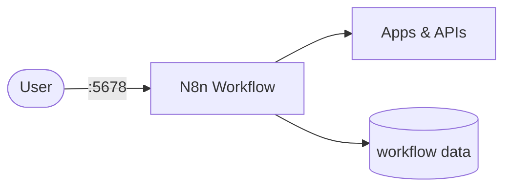

# n8n

n8n is a workflow automation tool that connects apps, APIs, and databases to create complex workflows.

## How it works



1. The deployment starts an n8n workflow automation server.
2. Create, run, and manage workflows via the web UI.
3. Workflow data persists via the PersistentVolumeClaim.
4. Connect to various apps and services through n8n's extensive node library.

## Stack details in this repo

- Image: `docker.n8n.io/n8nio/n8n:latest`
- Namespace: `n8n-ns`
- Deployment: `n8n-deployment` (3 replicas by default)
- Service: `n8n-service` (ClusterIP)
- ConfigMap: `n8n-config`
- Persistent Volume Claim: `n8n-pvc`
- Web UI: `http://<service-ip>:5678` (default)
- Persistent data:
  - `pvc/n8n-pvc:/root/.n8n`

## Kubernetes Resources

### Namespace

```bash
kubectl apply -f namespace.yaml
```

### ConfigMap

Create the ConfigMap with environment variables:

```bash
kubectl apply -f configmap.yaml
```

Edit `configmap.yaml` to customize n8n settings (timezone, DB, URLs, etc.).

### PersistentVolumeClaim

```bash
kubectl apply -f storage-claim.yaml
```

### Deployment

```bash
kubectl apply -f deployment.yaml
```

### Service

```bash
kubectl apply -f service.yaml
```

## How to run

```bash
kubectl apply -f .
```

This will create all required resources:

- Namespace
- ConfigMap
- PersistentVolumeClaim
- Deployment (3 replicas)
- Service

## Access

- Port-forward: `kubectl port-forward svc/n8n-service 5678:5678 -n n8n-ns`
- Access via: `http://localhost:5678`
- Or expose via Ingress/LoadBalancer for external access

## Notes

- 3 replicas are deployed by default for high availability.
- Workflow data persists via the PersistentVolumeClaim.
- ConfigMap contains n8n environment variables - customize as needed.
- Scale the deployment with `kubectl scale deployment n8n-deployment --replicas=N -n n8n-ns`
- Default settings include SQLite database; for production consider using PostgreSQL.