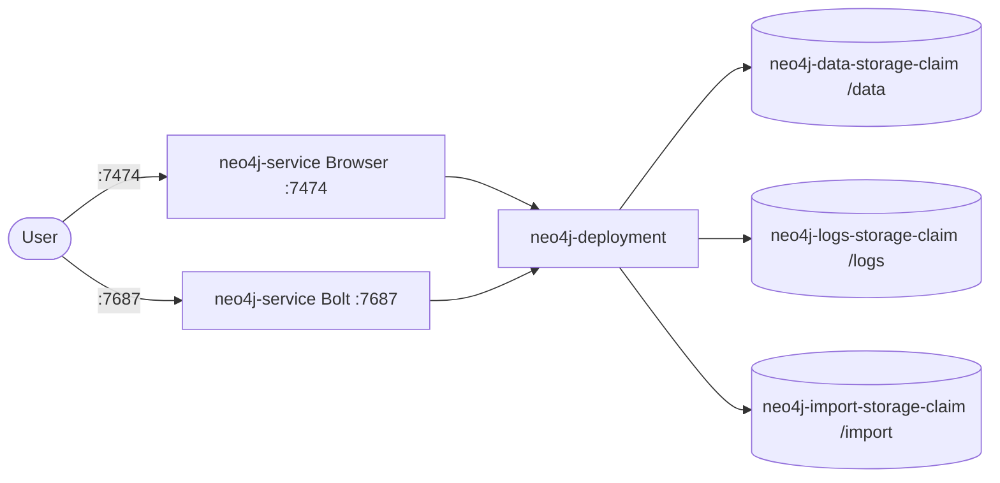

# Neo4j

Neo4j is a native graph database that stores data as nodes, relationships, and properties.
It uses the Cypher query language and is widely used for connected data — knowledge graphs, recommendation engines, fraud detection, and AI graph reasoning.

## How it works



1. Applications connect to `neo4j-deployment` (`neo4j:latest`) via the Bolt protocol on service port `7687` using official drivers.
2. The Neo4j Browser on service port `7474` provides a web-based Cypher editor with graph visualization.
3. Data is stored as nodes connected by labeled relationships, each with key-value properties.
4. Queries use Cypher, a declarative graph query language optimized for traversing relationships.
5. Data, logs, imports, plugins, and config persist in five PVCs mounted at `/data`, `/logs`, `/import`, `/plugins`, and `/conf`.

## Stack details in this repo

- Image: `neo4j:latest`
- Namespace: `neo4j-ns`
- Deployment: `neo4j-deployment` (4 replicas, container `neo4j`, `containerPort: 4747` (`neo4j-port-1`), `containerPort: 7687` (`neo4j-port-2`), `envFrom: neo4j-config`)
  - Volume mounts: `/data` -> `neo4j-data-storage-claim`, `/logs` -> `neo4j-logs-storage-claim`, `/import` -> `neo4j-import-storage-claim`, `/plugins` -> `neo4j-plugins-storage-claim`, `/conf` -> `neo4j-conf-storage-claim`
- Service: `neo4j-service` (ClusterIP `:7474` -> `7474`, `:7687` -> `7687`)
- ConfigMap: `neo4j-config` (`NEO4J_AUTH`, `NEO4J_PLUGINS`, `NEO4J_dbms_memory_pagecache_size`, `NEO4J_dbms_memory_heap_initial__size`, `NEO4J_dbms_memory_heap_max__size`)
- Persistent Volume Claims (5Gi each):
  - `neo4j-data-storage-claim` (5Gi, mounted at `/data`)
  - `neo4j-logs-storage-claim` (5Gi, mounted at `/logs`)
  - `neo4j-import-storage-claim` (5Gi, mounted at `/import`)
  - `neo4j-plugins-storage-claim` (5Gi, mounted at `/plugins`)
  - `neo4j-conf-storage-claim` (5Gi, mounted at `/conf`)
- Web UI (Browser): `http://<service-ip>:7474` (via Service / port-forward)
- Bolt API: `<service-ip>:7687` (via Service / port-forward)

## Kubernetes Resources

### Namespace

```bash
kubectl apply -f namespace.yaml
```

### ConfigMap

```bash
kubectl apply -f configmap.yaml
```

Edit `configmap.yaml` to change `NEO4J_AUTH` (`neo4j/password`), enabled plugins (`NEO4J_PLUGINS`), or JVM/memory settings before applying.

### PersistentVolumeClaim

```bash
kubectl apply -f storage-claim.yaml
```

### Deployment

```bash
kubectl apply -f deployment.yaml
```

### Service

```bash
kubectl apply -f service.yaml
```

## How to run

```bash
kubectl apply -f .
```

This will create all required resources:

- Namespace (`neo4j-ns`)
- ConfigMap (`neo4j-config`)
- PersistentVolumeClaims (`neo4j-data-storage-claim`, `neo4j-logs-storage-claim`, `neo4j-import-storage-claim`, `neo4j-plugins-storage-claim`, `neo4j-conf-storage-claim`)
- Deployment (`neo4j-deployment`)
- Service (`neo4j-service`)

## Access

- Port-forward Browser: `kubectl port-forward svc/neo4j-service 7474:7474 -n neo4j-ns`
- Port-forward Bolt: `kubectl port-forward svc/neo4j-service 7687:7687 -n neo4j-ns`
- Access via: `http://localhost:7474`
- Bolt: `bolt://localhost:7687`
- Or expose via Ingress/LoadBalancer for external access

Connect with `neo4j` / `password` (values from `NEO4J_AUTH` in `neo4j-config`).

## Notes

- Change the default password (`NEO4J_AUTH: neo4j/password` in `neo4j-config`) before exposing this stack outside local development.
- The import PVC (`neo4j-import-storage-claim`, mounted at `/import`) holds CSV/JSON files accessible with `file:///` in Cypher.
- APOC is enabled via `NEO4J_PLUGINS: '[ "apoc" ]'` — it provides procedures for data transformation, graph algorithms, and more.
- Note: `deployment.yaml` declares containerPort `4747` for `neo4j-port-1` while `service.yaml` uses port/targetPort `7474`; the Browser is reached on service port `7474`.
- For AI use cases, Neo4j supports vector indexes and can store/query embeddings.

## References

- Official site: <https://neo4j.com>
- Documentation: <https://neo4j.com/docs>
- Docker Hub image: <https://hub.docker.com/_/neo4j>
- GitHub repo: <https://github.com/neo4j/neo4j>
- YouTube — Beginner's Guide to Neo4j Graph Databases!: <https://www.youtube.com/watch?v=UF9gD4irBOE>
- Kubernetes documentation: <https://kubernetes.io/docs/>
