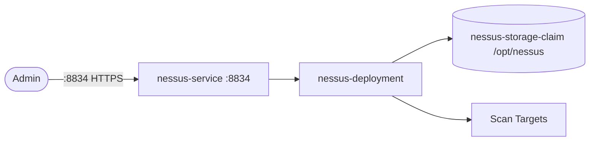

# Nessus

Nessus is a vulnerability scanner used for infrastructure and host security assessments.
This setup runs the official Nessus container with persistent scan/config data.

## How it works



1. `nessus-deployment` (`tenable/nessus:10.7.0-ubuntu`) starts and exposes the web interface via `nessus-service` on `:8834` (HTTPS).
2. You complete initial setup/license in the Nessus UI.
3. Scan policies and results are stored in `nessus-storage-claim` mounted at `/opt/nessus`.
4. Future restarts reuse the same Nessus state/data from the PVC.

## Stack details in this repo

- Image: `tenable/nessus:10.7.0-ubuntu`
- Namespace: `nessus-ns`
- Deployment: `nessus-deployment` (4 replicas, container `nessus`, `containerPort: 8834` (`nessus-port`), volume mount `/opt/nessus` -> `nessus-storage-claim`)
- Service: `nessus-service` (ClusterIP `:8834` -> `8834`)
- Persistent Volume Claims:
  - `nessus-storage-claim` (5Gi, mounted at `/opt/nessus`)
- Web UI: `https://<service-ip>:8834` (via Service / port-forward)

## Kubernetes Resources

### Namespace

```bash
kubectl apply -f namespace.yaml
```

### PersistentVolumeClaim

```bash
kubectl apply -f storage-claim.yaml
```

### Deployment

```bash
kubectl apply -f deployment.yaml
```

### Service

```bash
kubectl apply -f service.yaml
```

## How to run

```bash
kubectl apply -f .
```

This will create all required resources:

- Namespace (`nessus-ns`)
- PersistentVolumeClaim (`nessus-storage-claim`)
- Deployment (`nessus-deployment`)
- Service (`nessus-service`)

## Access

- Port-forward: `kubectl port-forward svc/nessus-service 8834:8834 -n nessus-ns`
- Access via: `https://localhost:8834`
- Or expose via Ingress/LoadBalancer for external access

## Notes

- Browser certificate warnings are expected on first load (Nessus serves HTTPS with a self-signed certificate).
- Initial plugin updates can take time before Nessus is fully ready; check `kubectl logs -f deploy/nessus-deployment -n nessus-ns` if the UI is not immediately available.
- No environment variables or ConfigMap are required by these manifests.
- Scan data persists via `nessus-storage-claim` (5Gi) at `/opt/nessus`.

## References

- Official site: <https://www.tenable.com/products/nessus>
- Documentation - Deploy Nessus as Docker: <https://docs.tenable.com/nessus/Content/DeployNessusDocker.htm>
- Docker Hub image: <https://hub.docker.com/r/tenable/nessus>
- YouTube — Nessus Vulnerability Scanner Tutorial (Cyber Security Tools): <https://www.youtube.com/watch?v=x87gbgQD4eg>
- Kubernetes documentation: <https://kubernetes.io/docs/>
