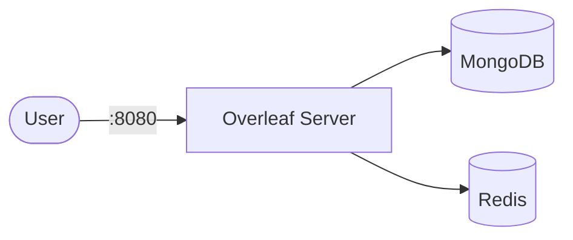

# Overleaf

Overleaf is an open-source online real-time collaborative LaTeX editor.
It provides a browser-based editor with rich LaTeX support, collaboration features, and project management.

## How Overleaf works



1. Overleaf serves a web-based LaTeX editor with real-time collaboration.
2. MongoDB stores project data, user accounts, and document metadata.
3. Redis handles session caching and pub/sub for document updates.
4. LaTeX compilation runs inside the container (no sandboxing in CE).

## Stack details in this repo

- Image: `overleaf/overleaf:latest`
- Database image: `mongo:8.0` (single-node replica set `overleaf`)
- Cache image: `redis:6.2`
- Namespace: `overleaf-ns`
- Deployments: `overleaf-deployment` (1 replica), `overleaf-mongo-deployment` (1 replica), `overleaf-redis-deployment` (1 replica)
- Services: `overleaf-service` (ClusterIP `:8080` → `:80`), `overleaf-mongo-service` (ClusterIP `:27017`, internal only), `overleaf-redis-service` (ClusterIP `:6379`, internal only)
- ConfigMaps: `overleaf-config` (app settings), `overleaf-mongo-config` (`MONGO_INITDB_DATABASE`)
- Persistent Volume Claims:
  - `overleaf-data-storage-claim` (5Gi, mounted at `/var/lib/overleaf`)
  - `overleaf-mongo-storage-claim` (5Gi, mounted at `/data/db`)
  - `overleaf-redis-storage-claim` (2Gi, mounted at `/data`)
- Web UI: `http://<service-ip>:8080` (default)

### Compose mapping

| Compose service | Kubernetes resources |
| --- | --- |
| `overleaf` (port `80`, `OVERLEAF_*`/`REDIS_*` env, data volume, `stop_grace_period: 60s`) | `overleaf-deployment` + `overleaf-service` (`:8080` → `:80`, `terminationGracePeriodSeconds: 60`), env from `overleaf-config` |
| `mongo` (`mongo:8.0`, `--replSet overleaf`, data volume, `MONGO_INITDB_DATABASE`, mongosh healthcheck) | `overleaf-mongo-deployment` (`args: [--replSet, overleaf]`) + `overleaf-mongo-service` + `overleaf-mongo-storage-claim`, mongosh ping probes |
| `redis` (`redis:6.2`, data volume) | `overleaf-redis-deployment` + `overleaf-redis-service` + `overleaf-redis-storage-claim`, `redis-cli ping` probes |
| `${OVERLEAF_DATA}`, `${MONGO_DATA}`, `${REDIS_DATA}` bind mounts | PVCs in `storage-claim.yaml` |
| `${OVERLEAF_PORT:-8080}`, `${OVERLEAF_REVISION:-latest}`, `${OVERLEAF_APP_NAME}` | `overleaf-service` port + `overleaf-config` — edit before applying |

## Kubernetes Resources

### Namespace

```bash
kubectl apply -f namespace.yaml
```

### ConfigMap

```bash
kubectl apply -f configmap.yaml
```

Edit `configmap.yaml` to customize the app name, Mongo/Redis hosts, or feature flags.

### PersistentVolumeClaim

```bash
kubectl apply -f storage-claim.yaml
```

### Deployment

```bash
kubectl apply -f deployment.yaml
```

### Service

```bash
kubectl apply -f service.yaml
```

## How to run

```bash
kubectl apply -f .
```

This will create all required resources:

- Namespace
- ConfigMaps
- PersistentVolumeClaims (app data, MongoDB, Redis)
- Deployments (Overleaf + MongoDB + Redis)
- Services (Overleaf + MongoDB + Redis)

Then initialize the single-node MongoDB replica set (required once, data persists on the PVC):

```bash
kubectl exec -n overleaf-ns deploy/overleaf-mongo-deployment -- mongosh --quiet --eval 'rs.initiate({_id: "overleaf", members: [{_id: 0, host: "overleaf-mongo-service:27017"}]})'
```

## Access

- Port-forward: `kubectl port-forward svc/overleaf-service 8080:8080 -n overleaf-ns`
- Access via: `http://localhost:8080`
- Or expose via Ingress/LoadBalancer for external access

Register the first admin account on the welcome page.

## Use it effectively

- Overleaf supports real-time collaboration with multiple users editing the same document.
- Use the project management dashboard to organize LaTeX projects.
- Rich LaTeX editor with autocomplete, syntax highlighting, and PDF preview.
- Configure SMTP settings to enable email notifications and invitations.

## Notes

- MongoDB requires a replica set (`--replSet overleaf`, passed as container args); run the one-time `rs.initiate` above — the compose `extra_hosts: mongo:127.0.0.1` trick has no K8s equivalent, so the member host uses the ClusterIP service DNS name.
- The Community Edition runs LaTeX compiles inside the main container; all users share the same environment. For untrusted users, consider Overleaf Server Pro for sandboxed compiles.
- No Secret is used here — the compose stack sets no passwords (MongoDB runs without auth, matching compose).
- MongoDB and Redis run with 1 replica each — do not scale them.
- See [Overleaf GitHub](https://github.com/overleaf/overleaf) for more details.
