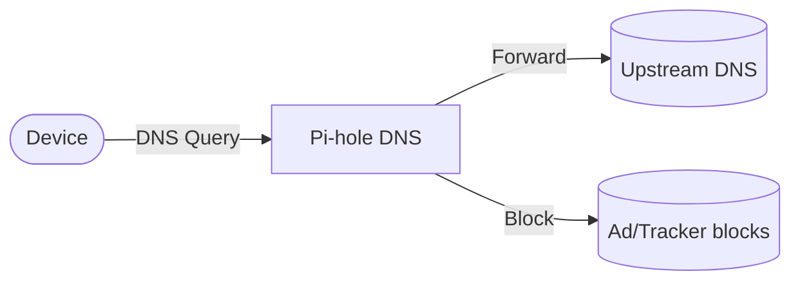

# pihole

Pi-hole is a DNS sinkhole that blocks ads and trackers across your network.

## How it works



1. The deployment starts a Pi-hole DNS server.
2. All DNS queries are routed to Pi-hole.
3. Ads and trackers are blocked at the DNS level.
4. Query logs and configuration persist via the PersistentVolumeClaim.

## Stack details in this repo

- Image: `pihole/pihole:latest`
- Namespace: `pihole-ns`
- Deployment: `pihole-deployment` (4 replicas by default)
- Service: `pihole-service`
- ConfigMap: `pihole-config`
- Persistent Volume Claim: `pihole-storage`
- Ports: `53` (DNS), `8080` (HTTP), `8443` (HTTPS)
- Timezone: `Asia/Manila` (configurable via ConfigMap)
- Persistent data:
  - `pvc/pihole-storage:/data`

## Kubernetes Resources

### Namespace

```bash
kubectl apply -f namespace.yaml
```

### ConfigMap

Create the ConfigMap with environment variables:

```bash
kubectl apply -f configmap.yaml
```

Edit `configmap.yaml` to set `TZ`, `WEBPASSWORD`, `DNS1`, and `DNS2`.

### PersistentVolumeClaim

```bash
kubectl apply -f storage-claim.yaml
```

### Deployment

```bash
kubectl apply -f deployment.yaml
```

### Service

```bash
kubectl apply -f service.yaml
```

## How to run

```bash
kubectl apply -f .
```

This will create all required resources:

- Namespace
- ConfigMap
- PersistentVolumeClaim
- Deployment (4 replicas)
- Service

## Access

- Web UI: `http://localhost:8080` or `https://localhost:8443` (via port-forward or service)
- DNS: Configure your devices to use the Pi-hole as their DNS server
- Port-forward examples:
  - `kubectl port-forward svc/pihole-service 8080:8080 -n pihole-ns`
  - `kubectl port-forward svc/pihole-service 8443:8443 -n pihole-ns`

## Notes

- 4 replicas are deployed by default for high availability.
- Change the default `WEBPASSWORD` before exposing publicly.
- DNS queries are logged and ad/tracker blocking is visible in the Web UI.
- Upstream DNS servers can be configured via the ConfigMap.
- Data persists via the PersistentVolumeClaim.