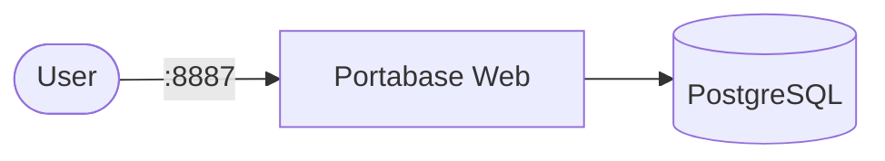

# Portabase

Portabase is a self-hosted application for building internal knowledge bases, intranet sites, and documentation portals. It runs as a containerized web app backed by PostgreSQL for persistent storage.

## How Portabase works



1. The Portabase web app starts and serves HTTP traffic on port `80` inside the container.
2. A PostgreSQL database container stores application data, user accounts, and configuration.
3. The app depends on the database and checks `/api/health` before receiving traffic (readiness probe).
4. Persistent data survives restarts via PersistentVolumeClaims.

## Stack details in this repo

- App image: `portabase/portabase:latest`
- Database image: `postgres:16-alpine`
- Namespace: `portabase-ns`
- Deployments: `portabase-deployment` (1 replica), `portabase-db-deployment` (1 replica)
- Services: `portabase-service` (ClusterIP `:8887` → `80`), `portabase-db-service` (ClusterIP `:5432`, internal only)
- ConfigMaps: `portabase-config` (app settings from `.env.example`), `portabase-db-config`
- Secret: `portabase-secrets` (`postgres-user`, `postgres-password`, `postgres-db`, `database-url`, `project-secret`, `smtp-password`, `auth-oidc-secret`, `auth-social-secret`)
- Persistent Volume Claims:
  - `portabase-data-storage-claim` (5Gi, mounted at `/data`)
  - `portabase-db-storage-claim` (5Gi, mounted at `/var/lib/postgresql/data`)
- Web UI: `http://<service-ip>:8887` (default)

### Compose mapping

| Compose service | Kubernetes resources |
| --- | --- |
| `application` (`portabase/portabase:latest`, `8887:80`, `TZ`, `env_file: .env`, `portabase-data:/data`, `depends_on` database, `curl /api/health` healthcheck) | `portabase-deployment` + `portabase-service` (`:8887` → `:80`), env from `portabase-config` + `portabase-secrets`, `/api/health` readiness/liveness probes |
| `database` (`postgres:16-alpine`, `postgres-data` volume, `POSTGRES_DB/USER/PASSWORD`, `pg_isready` healthcheck) | `portabase-db-deployment` + `portabase-db-service` + `portabase-db-storage-claim`, `pg_isready` readiness/liveness probes |
| `portabase-data`, `postgres-data` volumes | `portabase-data-storage-claim`, `portabase-db-storage-claim` PVCs |
| `.env` file (`DATABASE_URL`, `PROJECT_*`, `SMTP_*`, `AUTH_*`, etc.) | `portabase-config` + `portabase-secrets` — edit before applying |
| `5433:5432` database port mapping (local dev only) | not exposed — database is internal-only via `portabase-db-service:5432` |

## Kubernetes Resources

### Namespace

```bash
kubectl apply -f namespace.yaml
```

### Secret

Create the Secret with credentials (edit defaults before use):

```bash
kubectl apply -f secret.yaml
```

Important: if you change `postgres-user`, `postgres-password`, or `postgres-db`, update `database-url` to match — the app connects via `DATABASE_URL`, which points at `portabase-db-service:5432` (rewritten from the compose `localhost:5433` value).

### ConfigMap

```bash
kubectl apply -f configmap.yaml
```

Edit `configmap.yaml` to customize app settings (project URL, SMTP, OIDC/social auth, trusted domains, etc.).
Set `PROJECT_SECRET` and auth client secrets in `secret.yaml`.

### PersistentVolumeClaim

```bash
kubectl apply -f storage-claim.yaml
```

### Deployment

```bash
kubectl apply -f deployment.yaml
```

### Service

```bash
kubectl apply -f service.yaml
```

## How to run

```bash
kubectl apply -f .
```

This will create all required resources:

- Namespace
- Secret
- ConfigMaps
- PersistentVolumeClaims (app data + database)
- Deployments (Portabase + PostgreSQL)
- Services (Portabase + PostgreSQL)

## Access

- Port-forward: `kubectl port-forward svc/portabase-service 8887:8887 -n portabase-ns`
- Access via: `http://localhost:8887`
- Or expose via Ingress/LoadBalancer for external access

## Use Portabase effectively

- Use the web UI to create pages, collections, and internal documentation.
- Keep application data in the app-data PVC and database state in the db PVC.
- Manage credentials and environment settings via `secret.yaml` / `configmap.yaml`.
- Ensure the database is healthy before relying on the web app startup.

## Notes

- PostgreSQL is internal-only; the compose `5433` host mapping was dev-only and is not replicated.
- Do not commit real secrets to source control — the defaults match `.env.example` placeholders.
- PostgreSQL runs with 1 replica — do not scale it; scale only `portabase-deployment` with `kubectl scale deployment portabase-deployment --replicas=N -n portabase-ns`.
- The separate `agent/` edge-agent demo stack from the compose repo (with its own MongoDB test DBs) is out of scope here.
