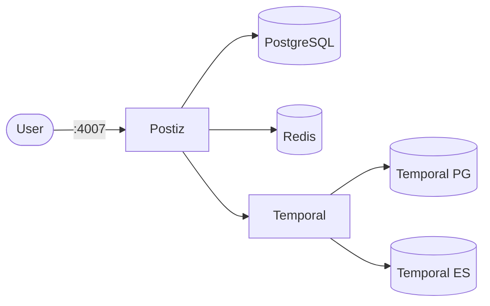

# Postiz

Postiz is a self-hosted social media scheduling and management tool.

## How it works



1. Postiz provides a web UI for scheduling posts across multiple platforms.
2. PostgreSQL stores posts, schedules, and user data.
3. Redis handles caching and background job processing.
4. Temporal orchestrates background workflows, backed by its own PostgreSQL and Elasticsearch.

## Stack details in this repo

- Postiz image: `ghcr.io/gitroomhq/postiz-app:latest`
- Dependencies: `postgres:17-alpine`, `redis:7.2`
- Temporal stack: `temporalio/auto-setup:1.28.1` + `postgres:16` + `elasticsearch:7.17.27`
- Namespace: `postiz-ns`
- Deployments: `postiz-deployment`, `postiz-db-deployment`, `postiz-redis-deployment`, `postiz-temporal-deployment`, `postiz-temporal-db-deployment`, `postiz-temporal-es-deployment` (1 replica each)
- Services: `postiz-service` (ClusterIP `:4007` → `:5000`), `postiz-db-service` (`:5432`), `postiz-redis-service` (`:6379`), `postiz-temporal-service` (`:7233`), `postiz-temporal-db-service` (`:5432`), `postiz-temporal-es-service` (`:9200`) — all internal except via port-forward
- ConfigMaps: `postiz-config` (app settings), `postiz-db-config`, `postiz-temporal-config` (temporal + ES settings), `postiz-temporal-dynamicconfig` (`development-sql.yaml`)
- Secrets: `postiz-secrets` (DB creds, `DATABASE_URL`, `JWT_SECRET`, API keys, OAuth secrets, Stripe keys), `postiz-temporal-secrets` (temporal DB creds)
- Persistent Volume Claims:
  - `postiz-config-storage-claim` (1Gi, mounted at `/config`)
  - `postiz-uploads-storage-claim` (5Gi, mounted at `/uploads`)
  - `postiz-db-storage-claim` (5Gi, mounted at `/var/lib/postgresql/data`)
  - `postiz-redis-storage-claim` (2Gi, mounted at `/data`)
  - `postiz-temporal-db-storage-claim` (5Gi, mounted at `/var/lib/postgresql/data`)
  - `postiz-temporal-es-storage-claim` (5Gi, mounted at `/usr/share/elasticsearch/data`)
- Web UI: `http://<service-ip>:4007` (default)

### Compose mapping

| Compose service | Kubernetes resources |
| --- | --- |
| `postiz` (port `5000`, full env list, `postiz-config` + `postiz-uploads` volumes, waits for postgres/redis/temporal) | `postiz-deployment` + `postiz-service` (`:4007` → `:5000`), env from `postiz-config` + `postiz-secrets` |
| `postiz-postgres` (`postgres:17-alpine`, `pg_isready` healthcheck) | `postiz-db-deployment` + `postiz-db-service` + `postiz-db-storage-claim`, `pg_isready` probes |
| `postiz-redis` (`redis:7.2`, `redis-cli ping` healthcheck) | `postiz-redis-deployment` + `postiz-redis-service` + `postiz-redis-storage-claim`, `redis-cli ping` probes |
| `temporal` (`temporalio/auto-setup:1.28.1`, `dynamicconfig` mount) | `postiz-temporal-deployment` + `postiz-temporal-service`, dynamic config from `postiz-temporal-dynamicconfig` ConfigMap |
| `temporal-postgresql` / `temporal-elasticsearch` (anonymous volumes) | `postiz-temporal-db/es-deployment` + services + PVCs |
| `spotlight`, `temporal-admin-tools`, `temporal-ui` (monitoring/debug auxiliaries) | omitted — run them separately if needed |
| `postiz-network` / `temporal-network` bridge networks | not needed — pods communicate via ClusterIP DNS |

## Kubernetes Resources

### Namespace

```bash
kubectl apply -f namespace.yaml
```

### Secret

```bash
kubectl apply -f secret.yaml
```

Set a unique `jwt-secret` per install and fill in your social platform credentials. If you change the app database user/password/name, update `database-url` to match (hosts rewritten to ClusterIP services).

### ConfigMap

```bash
kubectl apply -f configmap.yaml
```

Edit `configmap.yaml` for URLs, feature flags, and temporal/ES tuning.

### PersistentVolumeClaim

```bash
kubectl apply -f storage-claim.yaml
```

### Deployment

Apply dependencies first so Temporal is up before the app needs it:

```bash
kubectl apply -f deployment.yaml
```

### Service

```bash
kubectl apply -f service.yaml
```

## How to run

```bash
kubectl apply -f .
```

This will create all required resources:

- Namespace
- Secrets
- ConfigMaps (including temporal dynamic config)
- PersistentVolumeClaims (config, uploads, databases, redis, temporal ES)
- Deployments (Postiz + PostgreSQL + Redis + Temporal + Temporal PG + Temporal ES)
- Services (all six)

## Access

- Port-forward: `kubectl port-forward svc/postiz-service 4007:4007 -n postiz-ns`
- Access via: `http://localhost:4007`
- Or expose via Ingress/LoadBalancer for external access

## Notes

- Configure your social media API credentials in `secret.yaml`/`configmap.yaml` for each platform.
- First startup can take several minutes (Temporal auto-setup + app init).
- All databases run with 1 replica each — do not scale them.
