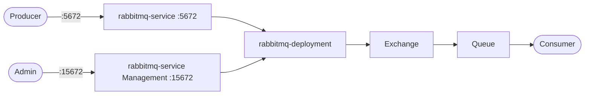

# RabbitMQ

RabbitMQ is a message broker for asynchronous communication between services.
Producers publish messages to queues/exchanges, and consumers receive/process them.

## How it works



1. Producers publish messages to `rabbitmq-deployment` (`rabbitmq:3-management`) via `rabbitmq-service` on `:5672` (AMQP).
2. RabbitMQ routes messages to queues based on exchange/binding rules.
3. Consumers subscribe to queues and process messages.
4. The management UI on `:15672` lets you inspect queues, exchanges, connections, and rates.

## Stack details in this repo

- Image: `rabbitmq:3-management`
- Namespace: `rabbitmq-ns`
- Deployment: `rabbitmq-deployment` (4 replicas, container `rabbitmq`, `containerPort: 15672` (`rabbitmq-mgmt-port`), `containerPort: 5672` (`rabbitmq-port`), `envFrom: rabbitmq-config`)
- Service: `rabbitmq-service` (ClusterIP `:15672` -> `15672`, `:5672` -> `5672`)
- ConfigMap: `rabbitmq-config` (`RABBITMQ_DEFAULT_USER`, `RABBITMQ_DEFAULT_PASS`)
- Web UI: `http://<service-ip>:15672` (via Service / port-forward)
- AMQP: `<service-ip>:5672` (via Service / port-forward)

## Kubernetes Resources

### Namespace

```bash
kubectl apply -f namespace.yaml
```

### ConfigMap

```bash
kubectl apply -f configmap.yaml
```

Edit `configmap.yaml` to change `RABBITMQ_DEFAULT_USER` / `RABBITMQ_DEFAULT_PASS` (defaults `admin` / `admin`) before applying.

### Deployment

```bash
kubectl apply -f deployment.yaml
```

### Service

```bash
kubectl apply -f service.yaml
```

## How to run

```bash
kubectl apply -f .
```

This will create all required resources:

- Namespace (`rabbitmq-ns`)
- ConfigMap (`rabbitmq-config`)
- Deployment (`rabbitmq-deployment`)
- Service (`rabbitmq-service`)

## Access

- Port-forward Management UI: `kubectl port-forward svc/rabbitmq-service 15672:15672 -n rabbitmq-ns`
- Port-forward AMQP: `kubectl port-forward svc/rabbitmq-service 5672:5672 -n rabbitmq-ns`
- Access via: `http://localhost:15672`
- AMQP: `localhost:5672`
- Or expose via Ingress/LoadBalancer for external access

Login using `RABBITMQ_DEFAULT_USER` / `RABBITMQ_DEFAULT_PASS` from `rabbitmq-config`.

## Notes

- Change default credentials (`admin` / `admin` in `rabbitmq-config`) before exposing RabbitMQ externally.
- Port `5672` should be reachable by app containers/services that publish or consume.
- This stack defines no PersistentVolumeClaim in these manifests — messages are ephemeral across pod restarts; add a PVC and volume mount for durable queues if needed.
- Create queues/exchanges from the management UI for quick testing, and monitor unacked and ready message counts to detect backlogs.

## References

- Official site: <https://www.rabbitmq.com>
- Documentation: <https://www.rabbitmq.com/docs>
- Docker Hub image: <https://hub.docker.com/_/rabbitmq>
- YouTube — RabbitMQ Tutorial - Message Queues and Distributed Systems: <https://www.youtube.com/watch?v=nFxjaVmFj5E>
- Kubernetes documentation: <https://kubernetes.io/docs/>
