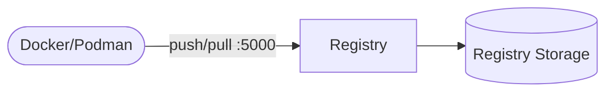

# Docker Registry

Distribution registry provides a private OCI/Docker image registry.

## How it works



1. Registry serves image push/pull API on port `5000`.
2. Images are stored in filesystem storage on the PersistentVolumeClaim.
3. Docker/Podman clients can tag and push to this endpoint.

## Stack details in this repo

- Image: `registry:2`
- Namespace: `registry-ns`
- Deployment: `registry-deployment` (1 replica)
- Service: `registry-service` (ClusterIP `:5000`)
- ConfigMap: `registry-config`
- Persistent Volume Claim: `registry-data-storage-claim` (10Gi, mounted at `/var/lib/registry`)
- Endpoint: `http://<service-ip>:5000`

### Compose mapping

| Compose service | Kubernetes resources |
| --- | --- |
| `registry` (port `5000`, `REGISTRY_*` env, `./data` bind mount) | `registry-deployment` + `registry-service`, env from `registry-config`, `/v2/` readiness/liveness probes |
| `./data:/var/lib/registry` bind mount | `registry-data-storage-claim` PVC |
| `${REGISTRY_PORT:-5000}` | `registry-service` port — edit before applying |

## Kubernetes Resources

### Namespace

```bash
kubectl apply -f namespace.yaml
```

### ConfigMap

```bash
kubectl apply -f configmap.yaml
```

### PersistentVolumeClaim

```bash
kubectl apply -f storage-claim.yaml
```

### Deployment

```bash
kubectl apply -f deployment.yaml
```

### Service

```bash
kubectl apply -f service.yaml
```

## How to run

```bash
kubectl apply -f .
```

This will create all required resources:

- Namespace
- ConfigMap
- PersistentVolumeClaim
- Deployment (1 replica)
- Service

## Access

Push/pull via port-forward:

```bash
kubectl port-forward svc/registry-service 5000:5000 -n registry-ns
docker tag myimage:latest localhost:5000/myimage:latest
docker push localhost:5000/myimage:latest
```

Or expose via Ingress/LoadBalancer (with TLS) for cluster-wide use.

## Notes

- This setup is HTTP-only by default.
- Configure TLS/auth before exposing outside trusted networks.
- No Secret is used — the compose stack sets no credentials.
- Grow `registry-data-storage-claim` as image storage needs increase.
