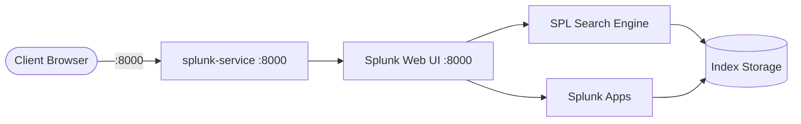
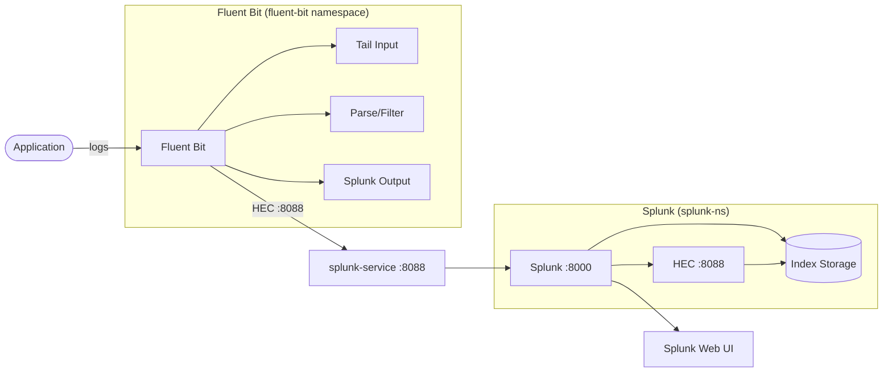

# Splunk

Splunk is a unified platform for monitoring, searching, analyzing, and visualizing machine-generated data at scale.
This stack runs Splunk Enterprise on Kubernetes for local/dev usage.

## What is Splunk?

Splunk ingests, indexes, and correlates machine data from virtually any source — logs, metrics, traces, security events, and more — providing a single source of truth for your organization's data.

## Use Cases

Splunk is widely used across multiple domains:

### Security (SIEM)
- **Threat detection & hunting** — Proactively uncover potential threats and anomalies.
- **Incident response** — Investigate and respond to security events in real time.
- **Compliance reporting** — Meet regulatory requirements (PCI, HIPAA, GDPR) with audit trails.
- **Risk-based alerting** — Prioritize security events by risk score.

### Observability & IT Operations
- **Infrastructure monitoring** — Track CPU, memory, disk, and network performance across systems.
- **Application performance monitoring (APM)** — Monitor application health, latency, and errors.
- **Log management** — Centralize, search, and analyze logs from any source.
- **Service level management** — Track SLAs and uptime metrics.

### DevOps & Engineering
- **Continuous deployment monitoring** — Track releases and deployment health.
- **Cloud monitoring** — Monitor cloud service providers (AWS, Azure, GCP).
- **Federated search** — Analyze data across platforms like S3, Snowflake, and Databricks.

### Business Analytics
- **Customer journey analysis** — Understand user interactions and behavior.
- **Help desk analytics** — Analyze support ticket patterns and resolution times.
- **Fraud detection** — Identify suspicious transaction patterns.

### Industry-Specific
- **Retail** — Monitor site performance and prevent revenue loss from downtime.
- **Healthcare** — Ensure compliance and track environmental/operational data.
- **Finance** — Detect fraud and secure financial transactions.
- **Education** — Protect hybrid campus infrastructure.

## How it works

### Standalone Splunk



1. Deployment creates 3 replicas of `splunk/splunk:latest` in namespace `splunk-ns`.
2. ConfigMap `splunk-config` auto-accepts license and sets the admin password.
3. Service `splunk-service` exposes Splunk Web UI on `8000` and HEC on `8088`.
4. Data is indexed internally by Splunk for search and analysis.

### Splunk + Fluent Bit Integration



1. Applications write logs to files or stdout.
2. Fluent Bit collects, parses, and forwards logs via the **Splunk output plugin**.
3. Logs are sent to Splunk's **HTTP Event Collector (HEC)** on port `8088` via `splunk-service`.
4. Splunk indexes the data for search, analysis, and visualization.

## Stack details in this repo

- Image: `splunk/splunk:latest`
- Namespace: `splunk-ns`
- Deployment: `splunk-deployment` (3 replicas)
- Service: `splunk-service` (ClusterIP)
- ConfigMap: `splunk-config`
- Ports:
  - `8000` — Splunk Web UI
  - `8088` — HTTP Event Collector (HEC)
- Persistent data: none by default (ephemeral) — add a PVC for production

## Kubernetes Resources

### Namespace

```bash
kubectl apply -f namespace.yaml
```

Creates isolated namespace `splunk-ns`.

### ConfigMap

```bash
kubectl apply -f configmap.yaml
```

Edit `configmap.yaml` to change:

- `SPLUNK_START_ARGS` — Startup args (default `--accept-license`)
- `SPLUNK_GENERAL_TERMS` — General terms acceptance
- `SPLNK_PASSWORD` — Admin password (change before exposing)

### Deployment

```bash
kubectl apply -f deployment.yaml
```

Deploys 3 replicas with `envFrom` referencing `splunk-config`.

### Service

```bash
kubectl apply -f service.yaml
```

Exposes ports `8000` and `8088` inside the cluster via ClusterIP.

## Environment variables

The following environment variables are configured via the ConfigMap `splunk-config`:

- `SPLUNK_START_ARGS` — Set to `--accept-license` to automatically accept the license on startup.
- `SPLUNK_GENERAL_TERMS` — Set to `--accept-sgt-current-at-splunk-com` to accept the Splunk General Terms.
- `SPLNK_PASSWORD` — Sets the admin password for the Splunk instance (default `YourStrongPassword123!`).

> **Note:** For production, move sensitive values like `SPLNK_PASSWORD` to a `Secret` instead of a ConfigMap.

## How to run

Apply all manifests from this directory:

```bash
kubectl apply -f .
```

This will create:

- Namespace
- ConfigMap
- Deployment
- Service

Verify resources:

```bash
kubectl get pods,svc -n splunk-ns
kubectl get configmap splunk-config -n splunk-ns -o yaml
```

Delete application:

```bash
kubectl delete -f .
```

## Access

Splunk is exposed as ClusterIP. Use port-forward for local access:

```bash
# Web UI
kubectl port-forward svc/splunk-service 8000:8000 -n splunk-ns
# HEC
kubectl port-forward svc/splunk-service 8088:8088 -n splunk-ns
```

Then open:

- Splunk Web UI: `http://localhost:8000` — login with `admin` / password from `SPLNK_PASSWORD`
- HEC endpoint: `http://localhost:8088/services/collector/event`

Or expose via Ingress/LoadBalancer/NodePort for external access:

```bash
kubectl port-forward svc/splunk-service 8000:8000 --address 0.0.0.0 -n splunk-ns
```

> **Note:** On first startup, Splunk initializes its indexes and may take a few minutes before the web UI is ready. Check logs with `kubectl logs -f deployment/splunk-deployment -n splunk-ns` and wait until the pod is Ready.

## Integration with Fluent Bit

[Fluent Bit](https://fluentbit.io/) is a lightweight log processor that can route Kubernetes logs to Splunk via HEC. This repo includes a [`fluent-bit`](../fluent-bit/) stack.

### Prerequisites

- Splunk HEC must be enabled in **Settings > Data Inputs > HTTP Event Collector**.
- Generate an HEC token in Splunk and use it for authentication.
- `splunk-service` must be reachable from the `fluent-bit` namespace.

### Fluent Bit Configuration

Add the following output to your Fluent Bit configuration to forward to Splunk in-cluster:

```ini
[OUTPUT]
    Name            splunk
    Match           *
    Host            splunk-service.splunk-ns.svc.cluster.local
    Port            8088
    Splunk_Token    <YOUR_HEC_TOKEN>
    Tls             Off
    Tls.Verify      Off
    Index           main
    Message_Key     message
```

Or using `fluent-bit.yaml`:

```yaml
pipeline:
  inputs:
    - name: tail
      path: /var/log/containers/*.log
      tag: kube.*
  outputs:
    - name: splunk
      match: '*'
      host: splunk-service.splunk-ns.svc.cluster.local
      port: 8088
      splunk_token: <YOUR_HEC_TOKEN>
      tls: off
      tls_verify: off
      index: main
```

### Running both stacks together

```bash
kubectl apply -f ../splunk/
kubectl apply -f ../fluent-bit/
```

Verify Fluent Bit health:

```bash
kubectl get pods -n fluent-bit
kubectl logs -f daemonset/fluent-bit -n fluent-bit
kubectl port-forward svc/fluent-bit 2020:2020 -n fluent-bit
curl http://localhost:2020/api/v1/health
```

### References

- [Fluent Bit Splunk Output Plugin](https://docs.fluentbit.io/manual/pipeline/outputs/splunk)
- [Splunk HTTP Event Collector Documentation](https://docs.splunk.com/Documentation/Splunk/latest/Data/UsetheHTTPEventCollector)
- [Fluent Bit Official Documentation](https://docs.fluentbit.io/)

## Useful commands

```bash
# Check rollout status
kubectl rollout status deployment/splunk-deployment -n splunk-ns

# View logs
kubectl logs -f deployment/splunk-deployment -n splunk-ns
kubectl logs -f -l app=splunk -n splunk-ns

# Scale replicas
kubectl scale deployment splunk-deployment --replicas=1 -n splunk-ns

# Describe resources
kubectl describe pod -l app=splunk -n splunk-ns
kubectl describe svc splunk-service -n splunk-ns

# Restart deployment
kubectl rollout restart deployment/splunk-deployment -n splunk-ns
```

## References

- **[Official Website](https://www.splunk.com)** — Splunk homepage, products, and resources.
- **[Documentation](https://docs.splunk.com/Documentation)** — Comprehensive Splunk documentation and guides.
- **[Splunk Lantern](https://lantern.splunk.com/)** — Customer success center with tips, use cases, and how-tos.
- **[Splunk Use Cases](https://www.splunk.com/en_us/solutions/all-use-cases.html)** — Explore all use cases across security, observability, and more.
- **[Splunk Community](https://www.splunk.com/en_us/community.html)** — Ask questions and share knowledge.
- **[Splunkbase](https://splunkbase.splunk.com/)** — Browse 1,000+ apps and add-ons.
- **[Splunk Dev](https://dev.splunk.com/)** — Build your own Splunk apps and integrations.
- **[Splunk Training & Certification](https://www.splunk.com/en_us/training.html)** — Become a certified Splunk expert.
- **[Splunk Download](https://www.splunk.com/en_us/download.html)** — Free trials and downloads.
- **[Splunk Enterprise Pricing](https://www.splunk.com/en_us/products/pricing.html)** — Pricing information.

## Notes

- The default admin password is set via `SPLNK_PASSWORD` in `configmap.yaml`. Change it to a strong password before deploying — consider using a Kubernetes `Secret`.
- This config is intended for local development and testing. For production, add persistent volumes for data retention, resource requests/limits, and proper Splunk clustering.
- Splunk requires significant system resources (memory and CPU). Ensure your cluster nodes have at least 4 GB RAM available per replica.
- The `splunk/splunk:latest` image tag may change over time; pin a specific tag for reproducible deployments.
- No PVC is configured by default — data is ephemeral and will be lost on pod deletion. Add a `PersistentVolumeClaim` and mount to `/opt/splunk/var` for persistence.
- HEC is exposed on port `8088`. Enable and configure it in Splunk UI after first login.
