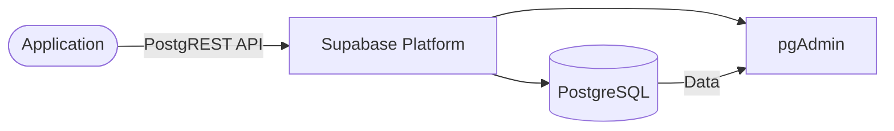

# supabase

Supabase is an open-source Firebase alternative that provides a PostgreSQL database, authentication, APIs, and more.

## How it works



1. The deployment starts a complete Supabase platform including PostgreSQL, PostgREST API, and pgAdmin.
2. PostgreSQL database stores all application data.
3. PostgREST API provides immediate RESTful access to the database.
4. pgAdmin provides a visual interface for database management.

## Stack details in this repo

- Image: `postgres:16`, `postgrest/postgrest:v12.2.3`, `dpage/pgadmin4:latest`
- Namespace: `supabase`
- Deployments: `supabase-db` (PostgreSQL), `supabase-rest` (PostgREST), `supabase-ui` (pgAdmin)
- Services: `supabase-db` (ClusterIP), `supabase-rest` (ClusterIP), `supabase-ui` (NodePort)
- Secrets: `supabase-secrets` (postgres credentials, pgadmin credentials, jwt-secret)
- ConfigMap: `supabase-config` (database schemas, anon role, ports)
- Persistent Volume Claims: `supabase-db-data` (PostgreSQL), `supabase-ui-data` (pgAdmin)
- Ports: `5432` (PostgreSQL), `3000` (PostgREST), `80`/`30050` (pgAdmin)
- Persistent data:
  - `pvc/supabase-db-data:/var/lib/postgresql/data` (PostgreSQL)
  - `pvc/supabase-ui-data:/var/lib/pgadmin` (pgAdmin)

## Kubernetes Resources

### Namespace

```bash
kubectl apply -f namespace.yaml
```

### ConfigMap

Create the ConfigMap with environment variables:

```bash
kubectl apply -f configmap.yaml
```

Edit `configmap.yaml` to set `postgres-schemas` and `postgres-anon-role`.

### Secrets

Create the Secret with secure credentials:

```bash
kubectl apply -f secret.yaml
```

Edit `secret.yaml` to change default passwords and secrets.

### PersistentVolumeClaims

```bash
kubectl apply -f postgresql/storage-claim.yaml
kubectl apply -f pgadmin/storage-claim.yaml
```

This creates two PVCs: `supabase-db-data` and `supabase-ui-data`.

### Deployments

```bash
kubectl apply -f postgresql/deployment.yaml
kubectl apply -f pgadmin/deployment.yaml
kubectl apply -f postrest/deployment.yaml
```

### Services

```bash
kubectl apply -f postgresql/service.yaml
kubectl apply -f postrest/service.yaml
kubectl apply -f pgadmin/service.yaml
```

## How to run

```bash
kubectl apply -f .
```

This will create all required resources:

- Namespace
- ConfigMap
- Secret
- Two PersistentVolumeClaims
- Three Deployments (PostgreSQL, PostgREST, pgAdmin)
- Three Services

## Access

- PostgREST API: `http://localhost:3000` (via ClusterIP or port-forward)
- pgAdmin UI: `http://localhost:30050` or `http://<node-ip>:30050` (NodePort, via port-forward)
  - Port-forward: `kubectl port-forward svc/supabase-ui 30050:80 -n supabase`
- PostgreSQL: Internal ClusterIP service on port 5432 (for internal use only)
- Default credentials from `secret.yaml`:
  - User: `postgres`, Password: `postgres`
  - pgAdmin Email: `admin@local.dev`, Password: `admin`

## Notes

- Change all default passwords in `secret.yaml` before exposing publicly.
- PostgreSQL data persists via `supabase-db-data` PVC.
- pgAdmin data persists via `supabase-ui-data` PVC.
- PostgREST API auto-generates endpoints based on database tables and schemas.
- For production, use a managed PostgreSQL service and restrict network access.