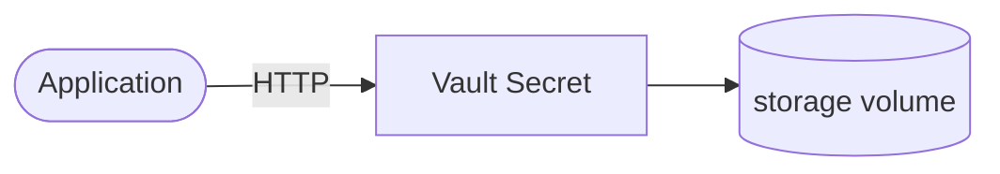

# vault

Vault is a secret management tool for securely storing and accessing tokens, passwords, APIs, and other secrets.

## How it works



1. The deployment starts a Vault secret management server.
2. Stores and manages secrets via a simple HTTP API.
3. Uses dev mode for development with an initial root token.
4. Data persists via the PersistentVolumeClaim.

## Stack details in this repo

- Image: `hashicorp/vault:latest`
- Namespace: `vault`
- Deployment: `vault` (1 replica)
- Service: `vault-service` (ClusterIP)
- ConfigMap: `vault-config`
- Secret: `vault-secrets`
- Persistent Volume Claim: `vault-data`
- Port: `8200` (default HTTP)
- Development mode with auto-unseal and initial root token
- Persistent data:
  - `pvc/vault-data:/vault/file`

## Kubernetes Resources

### Namespace

```bash
kubectl apply -f namespace.yaml
```

### ConfigMap

Create the ConfigMap with environment variables:

```bash
kubectl apply -f configmap.yaml
```

Edit `configmap.yaml` to set `VAULT_DEV_LISTEN_ADDRESS` if needed.

### Secret

Create the Secret with the root token:

```bash
kubectl apply -f secret.yaml
```

Edit `secret.yaml` to set a custom `VAULT_DEV_ROOT_TOKEN_ID`.

### PersistentVolumeClaim

```bash
kubectl apply -f storage-claim.yaml
```

### Deployment

```bash
kubectl apply -f deployment.yaml
```

### Service

```bash
kubectl apply -f service.yaml
```

## How to run

```bash
kubectl apply -f .
```

This will create all required resources:

- Namespace
- ConfigMap
- Secret
- PersistentVolumeClaim
- Deployment
- Service

## Access

- Port-forward: `kubectl port-forward svc/vault-service 8200:8200 -n vault`
- Access via: `http://localhost:8200`
- Root token from `secret.yaml` (or specified in `VAULT_DEV_ROOT_TOKEN_ID`)
- UI available at `http://localhost:8200/ui`

## Notes

- This runs in dev mode for testing - not suitable for production without proper unseal and storage configuration.
- The root token is stored in the Secret `vault-secrets` - change it before using in production.
- Data persists via the PersistentVolumeClaim.
- For production, use sealed storage, external backends, and proper initialization.