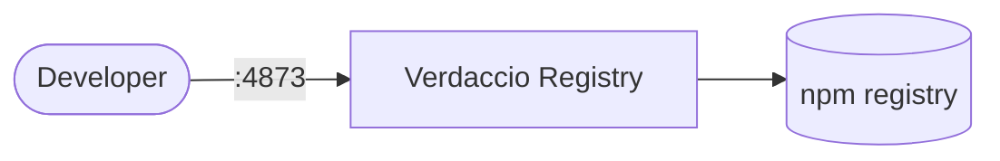

# verdaccio

Verdaccio is a lightweight private npm proxy registry.

## How it works



1. The deployment starts a Verdaccio npm registry.
2. Publish and install npm packages privately.
3. Packages are stored in the mounted storage volume.
4. Configuration and cached packages persist across restarts.

## Stack details in this repo

- Image: `verdaccio/verdaccio:latest`
- Namespace: `verdaccio-ns`
- Deployment: `verdaccio-deployment` (1 replica)
- Service: `verdaccio-service`
- Persistent Volume Claim: `verdaccio-storage-claim`
- Port: `4873` (default npm registry)
- Persistent data:
  - `pvc/verdaccio-storage-claim:/verdaccio/storage`

## Kubernetes Resources

### Namespace

```bash
kubectl apply -f namespace.yaml
```

### Deployment

```bash
kubectl apply -f deployment.yaml
```

### Service

```bash
kubectl apply -f service.yaml
```

### PersistentVolumeClaim

```bash
kubectl apply -f storage-claim.yaml
```

## How to run

```bash
kubectl apply -f .
```

This will create all required resources:

- Namespace
- Deployment
- Service
- PersistentVolumeClaim

## Access

- npm config: `npm set registry http://localhost:4873`
- Port-forward: `kubectl port-forward svc/verdaccio-service 4873:4873 -n verdaccio-ns`
- Access via: `http://localhost:4873`
- Or expose via Ingress/LoadBalancer for external access

## Notes

- 1 replica deployed by default.
- npm packages persist via the PersistentVolumeClaim.
- Configure authentication and access controls for production use.
- Default storage size is 5Gi - adjust `storage-claim.yaml` for more space.